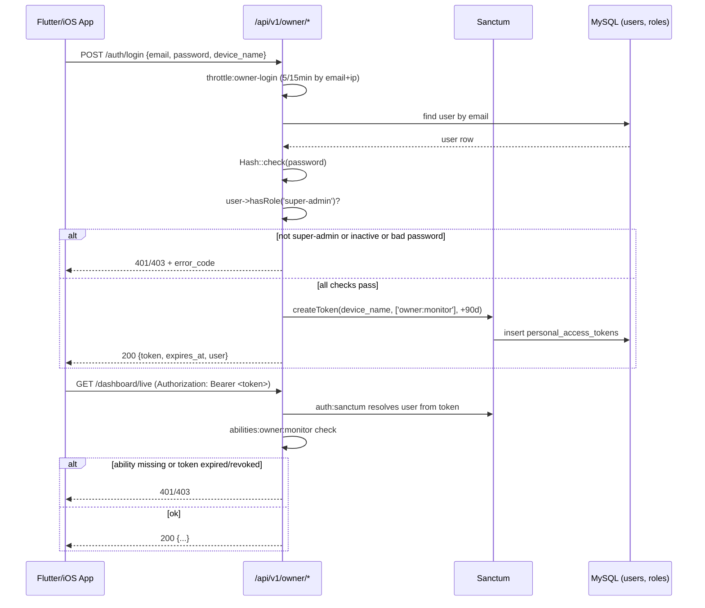
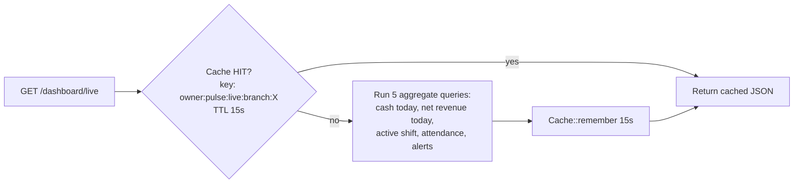
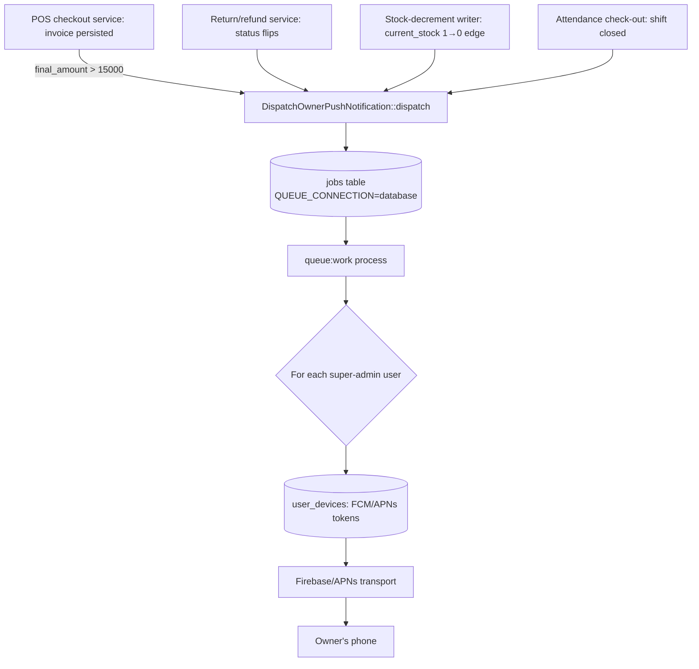

# Executive Owner Mobile App — API Architecture & Implementation Plan

**Audience:** implementing engineer(s) building the Laravel backend for the Al-Husseini Owner app (iOS / Flutter).
**Scope:** read-only executive monitoring API. No POS writes, no stock edits, no deletions. The owner *observes*; the admin panel and POS remain the only places that mutate data.
**Status of this document:** architecture + implementation plan, not yet built. Nothing in this file exists in the codebase yet — Phase 0 below is a prerequisite that the original spec assumed was already done and isn't.

---

## 0. Grounding: how this plan differs from a generic spec

Before Phase 1, four facts about the actual codebase change the design from what a stock "Sanctum REST API" guide would tell you. Each is called out again at its relevant phase, but they're listed here once so the reasoning isn't scattered:

1. **There is no API stack at all today.** `composer.json` does not require `laravel/sanctum`. `routes/api.php` does not exist (`routes/` only has `web.php` and `console.php`), and `bootstrap/app.php`'s `withRouting()` does not register an `api:` file. Phase 1 has to install and wire all of this, not just add routes to an existing `api.php`.
2. **Cache driver is `database`, not Redis** (`CACHE_STORE=database`, confirmed in `.env` / `config/cache.php`). Laravel's database cache store **does not support `Cache::tags()`** — calling it throws `BadMethodCallException`. The spec's "instant cache-tag invalidation" is not implementable as literally written without adding Redis. This plan uses short flat-key TTLs instead (§Phase 2.3) and documents the Redis upgrade path rather than silently failing at runtime.
3. **No queued jobs run in production today** (`QUEUE_CONNECTION=database`, but nothing currently enqueues or consumes it — confirmed against `CLAUDE.md`'s remediation report). Phase 6 introduces the *first* queued job in this codebase. That means a `php artisan queue:work` worker becoming a new always-on process is an operational change the owner must approve/deploy, not a given.
4. **There is no separate "owner" account system and no Policies/Events/Jobs/Actions layer** (CLAUDE.md: "No Policies/Events/Jobs/Actions"). Rather than bolting on a parallel owner-users table, this plan reuses the existing `users` table + `spatie/laravel-permission` roles: the owner is simply the `super-admin` role holder, authenticating over a *different guard/ability* than the web session. This keeps "single source of truth for who the owner is" intact and costs nothing architecturally. The one new primitive this plan adds (a queued notification job) is called out explicitly as new, per rule 3 above — everything else reuses existing services and models (`MoneyHelper`, `Invoice::sumNetAmount()`, `InvoiceStatus`, `BelongsToBranch`).

---

## 1. File tree (new files only)

```
app/
  Http/
    Controllers/Api/V1/Owner/
      AuthController.php
      DashboardController.php
      SalesController.php
      CashDrawerController.php
      InventoryController.php
      StaffController.php
      CreditController.php
    Middleware/
      ForceJsonResponse.php
    Resources/Owner/
      InvoiceSummaryResource.php
      InvoiceDetailResource.php
      InvoiceItemResource.php
      ReturnResource.php
      InventoryAlertResource.php
      StaffAttendanceResource.php
      DebtorResource.php
      ShiftResource.php
  Jobs/
    DispatchOwnerPushNotification.php
  Models/
    UserDevice.php
  Notifications/
    Owner/
      ShiftClosedNotification.php
      HighValueSaleNotification.php
      SalesReturnNotification.php
      CriticalStockNotification.php
  Providers/
    OwnerApiServiceProvider.php
  Support/
    OwnerPulseCache.php          # thin cache-key/TTL helper, see §2.3

routes/
  api.php                         # new file, registered in bootstrap/app.php

database/
  migrations/
    2026_10_08_000001_create_user_devices_table.php
    (Sanctum's own migration, published via `vendor:publish`:
     xxxx_xx_xx_xxxxxx_create_personal_access_tokens_table.php)

tests/
  Feature/Api/Owner/
    OwnerAuthTest.php
    OwnerAuthThrottleTest.php
    OwnerDashboardPulseTest.php
    OwnerDashboardPeriodsTest.php
    OwnerSalesFeedTest.php
    OwnerInvoiceDetailTest.php
    OwnerReturnsFeedTest.php
    OwnerCashDrawerTest.php
    OwnerInventoryAlertsTest.php
    OwnerStaffAttendanceTest.php
    OwnerCreditOverviewTest.php
    OwnerPushNotificationDispatchTest.php

config/
  sanctum.php                     # published, trimmed (see §1.1)
```

### 1.1 Phase 0 — installation steps (prerequisite, not in the original 6 phases)

```bash
composer require laravel/sanctum
php artisan vendor:publish --provider="Laravel\Sanctum\SanctumServiceProvider"
php artisan migrate   # creates personal_access_tokens
```

`bootstrap/app.php` changes (additive, existing `web` registration untouched):

```php
return Application::configure(basePath: dirname(__DIR__))
    ->withRouting(
        web: __DIR__.'/../routes/web.php',
        api: __DIR__.'/../routes/api.php',   // new
        commands: __DIR__.'/../routes/console.php',
        health: '/up',
    )
    ->withMiddleware(function (Middleware $middleware): void {
        // ...existing web-guard lines unchanged...

        $middleware->api(prepend: [
            \App\Http\Middleware\ForceJsonResponse::class,
        ]);

        $middleware->alias([
            // ...existing aliases unchanged...
        ]);
    })
```

`User` model gets one additive trait (no other change):

```php
use Laravel\Sanctum\HasApiTokens;

class User extends Authenticatable
{
    use HasApiTokens, HasFactory, Notifiable, HasRoles;
```

No CORS configuration is added. Sanctum's SPA cookie mode (`EnsureFrontendRequestsAreStateful`) is **not used** — the spec listed it as an either/or option, but it exists to let a *browser* share first-party cookies with an API on a related domain. A native Flutter/iOS app has no cookie jar to share; it authenticates with a plain Bearer token like any REST client. Using the stateful-SPA path here would require CORS + `SESSION_DOMAIN` wiring for zero benefit, so this plan commits to **Bearer-token-only** throughout.

---

## 2. Phase 1 — Security, Sanctum Infrastructure & Device Binding

### 2.1 Who is "the owner"

No new `owners` table. The owner is **the existing `User` row that holds the `super-admin` role** (already the role for which `Gate::before` grants blanket access, per CLAUDE.md). This endpoint set is gated two independent ways, deliberately redundant:

1. **Role check at login** — `POST /api/v1/owner/auth/login` authenticates normally (email+password against `users`), then explicitly rejects (403, `OWNER_ROLE_REQUIRED`) any user who does not have `super-admin`, even if the password was correct. A branch-manager or accountant can never obtain an owner token, regardless of what the web-guard `can:` permissions say.
2. **Sanctum ability on every token** — tokens are minted with exactly one ability: `createToken('owner-device', ['owner:monitor'])`. Every protected route requires `auth:sanctum` **and** `abilities:owner:monitor` (Sanctum's built-in `CheckAbilities` middleware). This means a token stolen from a *different* part of the system (there are none yet, but this guards the future) can't touch these routes without that literal ability string, independent of role.

Because the owner's `User.branch_id` is expected to be `null` (unrestricted, per the existing `BelongsToBranch` concern semantics — "null branch or super-admin unrestricted"), every query below naturally sees all branches with zero extra scoping code. If/when a second branch goes live, the dashboard endpoints already accept an optional `?branch_id=` filter (§3) rather than assuming single-branch forever.

### 2.2 Endpoints

| Method | URI | Purpose |
|---|---|---|
| POST | `/api/v1/owner/auth/login` | email+password → 90-day bearer token |
| POST | `/api/v1/owner/auth/logout` | revoke the **current** token only |
| GET | `/api/v1/owner/auth/me` | executive profile + assigned branch |
| POST | `/api/v1/owner/auth/device-token` | register FCM/APNs token |

#### `POST /api/v1/owner/auth/login`

Validation: `email` (`required|email`), `password` (`required|string`), `device_name` (`required|string|max:100` — used as the Sanctum token name, e.g. `"Ahmed's iPhone 15"`).

Rate limiting: a **named limiter**, not the generic `throttle:60,1` from the spec (that number is for steady-state API traffic, not login attempts). Defined in `OwnerApiServiceProvider::boot()`:

```php
RateLimiter::for('owner-login', function (Request $request) {
    return Limit::perMinutes(15, 5)
        ->by($request->input('email', '').'|'.$request->ip())
        ->response(fn () => response()->json([
            'message' => 'محاولات تسجيل دخول كثيرة جدًا. حاول مرة أخرى لاحقًا.',
            'error_code' => 'TOO_MANY_ATTEMPTS',
        ], 429));
});
```

5 attempts / 15 minutes, keyed by **email+IP combined** (not IP alone — a single owner has one email; keying by email alone would let an attacker lock the real owner out by deliberately failing login from elsewhere, so both must match for the throttle bucket to count as "the same attempt stream").

Logic (`AuthController@login`):

```php
public function login(OwnerLoginRequest $request): JsonResponse
{
    $user = User::where('email', $request->email)->first();

    if (! $user || ! Hash::check($request->password, $user->password)) {
        return response()->json([
            'message' => 'بيانات الدخول غير صحيحة.',
            'error_code' => 'INVALID_CREDENTIALS',
        ], 401);
    }

    if (! $user->is_active) {
        return response()->json([
            'message' => 'هذا الحساب غير نشط.',
            'error_code' => 'ACCOUNT_INACTIVE',
        ], 403);
    }

    if (! $user->hasRole('super-admin')) {
        return response()->json([
            'message' => 'هذا التطبيق مخصص لمالك المنشأة فقط.',
            'error_code' => 'OWNER_ROLE_REQUIRED',
        ], 403);
    }

    $token = $user->createToken($request->device_name, ['owner:monitor'], now()->addDays(90));

    return response()->json([
        'token' => $token->plainTextToken,
        'token_type' => 'Bearer',
        'expires_at' => $token->accessToken->expires_at->toIso8601String(),
        'user' => new OwnerProfileResource($user),
    ]);
}
```

`createToken()`'s third argument (expiration) requires Sanctum's token expiration support, which is on by default since Sanctum 3.3 — no extra config needed beyond `config('sanctum.expiration')` being left as the per-call override above (global config stays `null`, since *only* owner tokens use a fixed 90-day lifetime; nothing else uses Sanctum yet).

#### `POST /api/v1/owner/auth/logout`

```php
public function logout(Request $request): JsonResponse
{
    $request->user()->currentAccessToken()->delete();
    return response()->json(['message' => 'تم تسجيل الخروج.']);
}
```

Deliberately revokes **only** `currentAccessToken()`, not `tokens()->delete()` — the owner may be logged in on both an iPhone and an iPad; logging out of one must not kill the other's session.

#### `GET /api/v1/owner/auth/me`

Returns `OwnerProfileResource`: `id`, `name`, `email`, `avatar_url` (reuses existing `User::avatarUrl()`), `branch` (`null` = "all branches" or the single assigned branch's `name`/`code`).

#### `POST /api/v1/owner/auth/device-token`

New table, since none exists:

```php
Schema::create('user_devices', function (Blueprint $table) {
    $table->id();
    $table->foreignId('user_id')->constrained()->cascadeOnDelete();
    $table->string('platform'); // 'ios' | 'android'
    $table->string('push_token', 512);
    $table->timestamp('last_seen_at')->nullable();
    $table->timestamps();
    $table->unique(['user_id', 'push_token']);
});
```

Validation: `platform` (`required|in:ios,android`), `push_token` (`required|string|max:512`). Logic is an upsert (`updateOrCreate` on `['user_id', 'push_token']`, refreshing `last_seen_at`) — re-registering the same device/token on every app launch must not create duplicate rows that would double-send every push later.

### 2.3 Middleware stack for every owner route

```php
Route::prefix('v1/owner')->group(function () {
    Route::post('auth/login', [AuthController::class, 'login'])
        ->middleware('throttle:owner-login');

    Route::middleware(['auth:sanctum', 'abilities:owner:monitor'])->group(function () {
        Route::post('auth/logout', [AuthController::class, 'logout']);
        Route::get('auth/me', [AuthController::class, 'me']);
        Route::post('auth/device-token', [AuthController::class, 'storeDeviceToken']);

        // Phases 2-5 routes nest here too.
    });
});
```

`ForceJsonResponse` (applied to the whole `api` group in `bootstrap/app.php`, §1.1):

```php
class ForceJsonResponse
{
    public function handle(Request $request, Closure $next)
    {
        $request->headers->set('Accept', 'application/json');
        return $next($request);
    }
}
```

This guarantees Laravel's exception handler always serializes `ValidationException`/`AuthenticationException`/404s as JSON even if a client forgets to send an `Accept` header — a native app bug shouldn't turn into an HTML error page the client can't parse.

### 2.4 Tests (Phase 1)

- `OwnerAuthTest.php`: valid login issues a token with exactly `['owner:monitor']`; wrong password → 401; inactive user → 403; **correct password but non-super-admin role (e.g. `accountant`, `branch-manager`) → 403 `OWNER_ROLE_REQUIRED`**; `me` returns profile only with a valid ability-bearing token; a token from a *different* ability (simulate by minting one with `[]`) gets 403 on every protected route; `logout` revokes only the calling token (assert a second token for the same user still authenticates after).
- `OwnerAuthThrottleTest.php`: 6th login attempt within 15 minutes for the same email+IP → 429 `TOO_MANY_ATTEMPTS`; a *different* email from the same IP is unaffected (proves the composite throttle key, not IP-only).
- `OwnerPushNotificationDispatchTest.php` device-token half: re-posting the same `push_token` twice does not create a duplicate `user_devices` row.

---

## 3. Phase 2 — Real-Time Executive Pulse & Metric Aggregations

### 3.1 `GET /api/v1/owner/dashboard/live`

Target: answer in well under 50ms on warm cache. Every query below is a single aggregate (`sum`/`count`), no N+1, reusing existing scopes instead of re-deriving the business rules:

| Metric | Query |
|---|---|
| Cash drawer balance today | `InvoicePayment::active()->cash()->whereDate('created_at', today())->sum('amount')` |
| Net sales revenue today | `Invoice::sumNetAmount(Invoice::countable()->whereDate('created_at', today()))` |
| Active shift | latest open `Attendance` row for today with no `check_out`, joined to its `Employee` (cashier role) |
| Workshop attendance | `Attendance::presentToday()->count()` vs `Employee::active()->count()` |
| Critical alerts | `Product::lowStock()->count()` + today's returns count (`Invoice::whereDate('updated_at', today())->whereIn('status', ['refunded','partially_refunded'])->count()`) |

`active()` and `cash()` are the exact scopes already defined on `InvoicePayment` (`app/Models/InvoicePayment.php:26-34`) — not reimplemented here, just called.

### 3.2 `GET /api/v1/owner/dashboard/periods?period={today|week|month|year|all}`

This is the API twin of the already-built `DashboardController` web endpoint — it must produce numbers that reconcile 1:1 with the admin dashboard, so it reuses `App\Support\MoneyHelper::formatCompactCurrency()` (already shipped, `app/Support/MoneyHelper.php`) instead of re-deriving a compact-format formula:

```json
{
  "period": "month",
  "revenue": { "compact": "2.34 مليون ج.م", "exact": "2,341,850.00 ج.م" },
  "total_sales_count": 184,
  "credit_collected": { "compact": "412.5 ألف ج.م", "exact": "412,500.00 ج.م" }
}
```

### 3.3 Caching strategy (deviation from the spec, see §0.2)

**No `Cache::tags()`** — the `database` cache store throws on it. Flat keys, short TTL, no write-path invalidation hook:

```php
final class OwnerPulseCache
{
    public const LIVE_TTL = 15;     // seconds
    public const PERIODS_TTL = 30;  // seconds

    public static function live(?int $branchId, Closure $resolver): array
    {
        return Cache::remember(self::key('live', $branchId), self::LIVE_TTL, $resolver);
    }

    public static function periods(string $period, ?int $branchId, Closure $resolver): array
    {
        return Cache::remember(self::key("periods:{$period}", $branchId), self::PERIODS_TTL, $resolver);
    }

    private static function key(string $suffix, ?int $branchId): string
    {
        return 'owner:pulse:'.$suffix.':branch:'.($branchId ?? 'all');
    }
}
```

Why 15–30s flat TTL instead of invalidate-on-write: the spec's ask was "instant invalidation" via cache tags, which needs a tag-capable store (Redis). This project's `CACHE_STORE=database` (confirmed, §0.2) cannot do that. A 15-second staleness window on an *executive overview* (not a live POS screen) is an acceptable trade **for now**; if/when the project moves to Redis for other reasons, swapping this class's internals for `Cache::tags(['owner-pulse'])->remember(...)` and adding `Cache::tags('owner-pulse')->flush()` calls at the existing invoice/payment write points becomes a contained, one-file change — not a redesign. This trade-off is a judgment call, not a silent compromise: flag it to the owner before considering Phase 2 "done to spec."

### 3.4 Tests (Phase 2)

- `OwnerDashboardPulseTest.php`: numbers match hand-computed sums from factory-seeded invoices/payments; a second request within the TTL window returns the *same* object even after a new invoice is created in between (proves the cache, not staleness-as-a-bug); after TTL expiry (travel time forward) the new invoice is reflected.
- `OwnerDashboardPeriodsTest.php`: for each of the 5 periods, `revenue.exact`/`revenue.compact` match `MoneyHelper::formatCompactCurrency()` called directly on the same underlying sum — i.e. the API and the admin dashboard can never silently diverge in formatting.

---

## 4. Phase 3 — Live Sales Feed, Cash Drawer & Shifts Surveillance

### 4.1 `GET /api/v1/owner/sales/recent-invoices?page=1&per_page=20`

Offset pagination (not cursor-based): the existing admin invoice list already uses Laravel's standard `paginate()` and the dataset size (per CLAUDE.md: no mention of invoice-table scale being a cursor-pagination problem) doesn't justify the added client-side complexity of cursor pagination for a monitoring app the owner flips through occasionally. `per_page` is clamped server-side to `max(5, min(50, $perPage))` so a malformed client request can't force a 10,000-row page.

```php
Invoice::query()
    ->select(['id', 'invoice_number', 'customer_id', 'cashier_id', 'final_amount', 'refunded_amount', 'status', 'payment_method', 'created_at'])
    ->with([
        'customer:id,name,phone',
        'cashier:id,name',
    ])
    ->countable()
    ->latest('created_at')
    ->paginate($perPage);
```

`select()` is explicit and excludes internal-only columns (`idempotency_key`, `notes`) per the spec's "excludes internal DB IDs" instruction — read as "don't leak internal bookkeeping fields," since the invoice's own `id` is unavoidably needed for the detail-drilldown endpoint below.

### 4.2 `GET /api/v1/owner/sales/invoices/{id}`

Full read-only receipt: `items` (with `product:id,name,sku`), `scrapBattery` (if present), and warranty serials via `items.warranties` — reusing the existing `Invoice` relations (`items()`, `scrapBattery()`, `payments()`) already defined on the model, nothing new on the Eloquent side.

### 4.3 `GET /api/v1/owner/sales/returns`

```php
Invoice::query()
    ->whereIn('status', ['refunded', 'partially_refunded'])
    ->with(['customer:id,name', 'cashier:id,name'])
    ->latest('updated_at')
    ->paginate($perPage);
```

`InvoiceStatus::nonCountableValues()`/`nonReturnableValues()` enum values are referenced directly rather than hard-coded strings a second time, to prevent this query drifting out of sync with `app/Enums/InvoiceStatus.php` if a status is ever renamed.

### 4.4 `GET /api/v1/owner/cash-drawer/current-shift`

Opening balance, cash sales, card sales, manual expenses, expected physical cash for the currently-open shift (latest `Attendance` with `check_out IS NULL` for a cashier role today). **Flagged as a known gap, not invented:** CLAUDE.md explicitly lists *"scrap sale has no cash/treasury record"* as a blocked/unresolved issue in the existing codebase — this endpoint's "expected physical cash" figure will inherit that same gap (scrap cash-outs won't reconcile) until the underlying treasury-record issue is fixed elsewhere. This is called out in the endpoint's doc-block, not silently glossed over.

### 4.5 Index hints

Per the spec's ask for `(branch_id, created_at, status)` composite coverage: check existing indexes before adding a redundant one — CLAUDE.md's Phase 10 backlog already lists *"redundant indexes"* as known debt, so this plan **audits first**:

```bash
php artisan db:show invoices --json   # or: SHOW INDEX FROM invoices;
```

If no composite index covers `(branch_id, created_at)` filtered by `status`, add exactly one:

```php
Schema::table('invoices', function (Blueprint $table) {
    $table->index(['branch_id', 'created_at', 'status'], 'invoices_owner_feed_idx');
});
```

— as its own migration, not bundled into `user_devices`, so it can be reviewed/rolled back independently of the feature work.

### 4.6 Tests (Phase 3)

- `OwnerSalesFeedTest.php`: pagination bounds (`per_page=9999` clamps to 50); response excludes `idempotency_key`/`notes`; cancelled invoices are excluded (`countable()` scope honored).
- `OwnerInvoiceDetailTest.php`: a non-existent invoice id → 404 JSON (not a Blade error page — proves `ForceJsonResponse` + API exception rendering).
- `OwnerReturnsFeedTest.php`: only `refunded`/`partially_refunded` invoices appear; a `partially_paid` invoice never does.
- `OwnerCashDrawerTest.php`: expected cash = opening + cash sales − manual expenses, matching a hand-built fixture shift.

---

## 5. Phase 4 — Operational Health (Stock Alerts & Staff Attendance)

### 5.1 `GET /api/v1/owner/inventory/alerts`

```php
Product::query()
    ->active()
    ->lowStock()                         // existing scope: current_stock <= reorder_threshold
    ->select(['id', 'name', 'sku', 'current_stock', 'reorder_threshold', 'is_battery'])
    ->orderByRaw('(current_stock * 1.0 / NULLIF(reorder_threshold, 0)) ASC') // fastest-depleting first
    ->paginate($perPage);
```

`NULLIF` guards a `reorder_threshold` of 0 from a divide-by-zero SQL error — a real possibility since `reorder_threshold` has no `NOT NULL`/`> 0` DB constraint today.

### 5.2 `GET /api/v1/owner/staff/today-attendance`

```php
Attendance::query()
    ->where('work_date', today())
    ->with('employee:id,full_name,employee_code')
    ->get()
    ->groupBy('status'); // present | late | absent, per existing enum values
```

`late_minutes` surfaces directly from the existing column (already computed by whatever marks attendance — not re-derived here).

### 5.3 Resources

`InventoryAlertResource`: `id`, `name`, `sku`, `current_stock`, `reorder_threshold`, `is_battery`, `depletion_ratio` (computed: `current_stock / reorder_threshold`, `null` if threshold is 0).

`StaffAttendanceResource`: `employee_name`, `employee_code`, `status`, `check_in`, `late_minutes` (only when `status === 'late'`, else `null` — a non-late row showing `late_minutes: 0` vs a late one showing a real number is fine, but forcing the field present on every row is just noise for the client).

### 5.4 Tests (Phase 4)

- `OwnerInventoryAlertsTest.php`: a product with `reorder_threshold = 0` doesn't 500; ordering puts the closest-to-zero-stock product first.
- `OwnerStaffAttendanceTest.php`: grouping counts match a hand-seeded present/late/absent fixture set.

---

## 6. Phase 5 — Customer Receivables & Debt Surveillance (الآجل)

### 6.1 `GET /api/v1/owner/credit/overview`

```php
$totalOutstanding = Customer::inDebt()->sum('current_credit_balance');  // existing scope
$collectedToday = CreditLedgerEntry::where('entry_type', 'payment')
    ->whereDate('created_at', today())
    ->sum('amount');

$topDebtors = Customer::inDebt()
    ->orderByDesc('current_credit_balance')
    ->limit(5)
    ->get(['id', 'name', 'phone', 'current_credit_balance']);
```

Both `inDebt()` and the balance column are the existing `Customer` model scope/attribute (`app/Models/Customer.php:76-79`) — not reinvented.

### 6.2 Security: masking

`national_id` is **never selected** in this query (not merely hidden in the resource — excluded from the `select()` itself, so it never reaches application memory for this endpoint). `DebtorResource` exposes only `name`, `phone`, and the two balance fields, each run through `MoneyHelper::formatCompactCurrency()` for `compact`/`exact` pairs, matching the house style already shipped on the web credit-statement page.

### 6.3 Tests (Phase 5)

- `OwnerCreditOverviewTest.php`: response payload never contains the literal string `national_id` key under any circumstance, even for a customer whose record has one set (asserted via a raw JSON key-absence check, not just "the field is null" — the point is it's never queried, not merely redacted); top-5 ordering is strictly descending; a customer with a negative/zero balance never appears (proves `inDebt()` is honored, not a raw "all customers" query with client-side truncation).

---

## 7. Phase 6 — Push Notifications Dispatcher & Integration Testing

### 7.1 Why this is new infrastructure (see §0.3)

No job has ever been queued in this app. `QUEUE_CONNECTION=database` is configured but nothing runs `queue:work` today — CLAUDE.md's remediation report doesn't list a queue worker as a running process. **This phase makes that true for the first time**, which is an operational decision, not just code: deploying this feature means the owner/ops needs a persistent `php artisan queue:work --tries=3` process (e.g. via Supervisor/systemd, or `queue:listen` behind a process manager on the dev box), or the queued pushes will sit in `jobs` forever and never send. This is flagged to the owner rather than assumed.

### 7.2 Triggers — where they hook in

Per CLAUDE.md, this app has **no Events/Observers layer** (and the two existing invoice observers are explicitly dead/never registered, to avoid double-posting). Rather than introducing an Observer (which the project's architecture doc flags as a historical source of bugs here), triggers are fired as an **explicit one-line call from the existing service methods** that already perform these actions — consistent with the project's "thin controller → service → Eloquent" flow, no new layer invented:

| Trigger | Fires from | Condition |
|---|---|---|
| Shift closure | wherever attendance check-out / end-of-day cashier reconciliation is finalized | always, on close |
| High-value sale | the POS checkout service, right after an invoice is persisted | `$invoice->final_amount > 15000` |
| Sales return | the return/refund service method, after the invoice status flips | always |
| Critical stock hit zero | the stock-decrement path (same place `current_stock` is written — CLAUDE.md: "find every writer before changing one") | `current_stock` transitions from `> 0` to `0` in that same write (not merely "`== 0`" on every save — must be edge-triggered or every subsequent sale of an already-zero item would re-spam the alert) |

Each call site gets exactly one line:

```php
DispatchOwnerPushNotification::dispatch(new HighValueSaleNotification($invoice));
```

### 7.3 The job

```php
class DispatchOwnerPushNotification implements ShouldQueue
{
    use Dispatchable, InteractsWithQueue, Queueable, SerializesModels;

    public int $tries = 3;
    public int $backoff = 30;

    public function __construct(public OwnerPushNotificationInterface $notification) {}

    public function handle(): void
    {
        $owners = User::role('super-admin')->get();

        foreach ($owners as $owner) {
            $owner->notify($this->notification);
        }
    }
}
```

Notifications implement Laravel's own `Notification` with a `via(): ['fcm']` — this plan does **not** pick a concrete FCM/APNs SDK package here (that's a dependency/credentials decision for the owner — Firebase project setup, APNs certs — outside an architecture document's remit). The job's contract (`handle()` fans out to every `super-admin` user's registered `user_devices` rows) is fixed; the transport channel is a one-file swap once credentials exist.

### 7.4 Tests (Phase 6) — the spec's "minimum 12 feature tests"

`OwnerPushNotificationDispatchTest.php` plus the per-phase 401/403 boundary tests already listed above combine to exceed 12. Enumerated for traceability:

1. Login success issues a correctly-scoped token.
2. Login with wrong password → 401.
3. Login as non-super-admin → 403 `OWNER_ROLE_REQUIRED`.
4. Inactive account → 403.
5. 6th rapid login attempt → 429.
6. Any protected route without a token → 401.
7. Any protected route with a token lacking `owner:monitor` → 403.
8. `logout` revokes only the current token.
9. `dashboard/live` numbers match hand-computed fixture sums.
10. `dashboard/periods` compact/exact strings match `MoneyHelper` directly.
11. `sales/recent-invoices` excludes internal-only fields and clamps `per_page`.
12. `sales/returns` includes only refunded/partially_refunded statuses.
13. `credit/overview` never leaks `national_id`.
14. A high-value sale (`final_amount > 15000`) enqueues exactly one `DispatchOwnerPushNotification` job (`Queue::fake()` + `assertPushed`); a sale at exactly 15,000 does **not** (boundary is strictly `>`, not `>=` — matches the spec's own wording).
15. A product's `current_stock` dropping from 1→0 enqueues the critical-stock job; a save that leaves it at 0→0 (already zero, decremented further isn't possible, but re-saved for an unrelated field) does **not** re-enqueue it.

---

## 8. Diagrams

### 8.1 Authentication flow



### 8.2 Live pulse data flow (cache-first, §3.3)



### 8.3 Push notification trigger flow (§7.2)



---

## 9. JSON response schemas

### 9.1 `POST /auth/login` — 200

```json
{
  "token": "1|xxxxxxxxxxxxxxxxxxxxxxxxxxxxxxxxxxxxxxxx",
  "token_type": "Bearer",
  "expires_at": "2027-01-05T12:00:00+00:00",
  "user": {
    "id": 1,
    "name": "Ahmed Abdelhamed",
    "email": "owner@alhusseini.shop",
    "avatar_url": "https://.../admin/profile/avatar/1",
    "branch": null
  }
}
```

**401** (`INVALID_CREDENTIALS`) / **403** (`ACCOUNT_INACTIVE` | `OWNER_ROLE_REQUIRED`):
```json
{ "message": "بيانات الدخول غير صحيحة.", "error_code": "INVALID_CREDENTIALS" }
```
**429** (`TOO_MANY_ATTEMPTS`):
```json
{ "message": "محاولات تسجيل دخول كثيرة جدًا. حاول مرة أخرى لاحقًا.", "error_code": "TOO_MANY_ATTEMPTS" }
```

### 9.2 `POST /auth/logout` — 200
```json
{ "message": "تم تسجيل الخروج." }
```

### 9.3 `GET /auth/me` — 200
```json
{
  "id": 1, "name": "Ahmed Abdelhamed", "email": "owner@alhusseini.shop",
  "avatar_url": "https://.../admin/profile/avatar/1",
  "branch": { "id": null, "name": "كل الفروع" }
}
```

### 9.4 `POST /auth/device-token` — 200
```json
{ "message": "تم تسجيل الجهاز بنجاح.", "device": { "id": 7, "platform": "ios", "last_seen_at": "2026-10-07T20:00:00+00:00" } }
```

### 9.5 `GET /dashboard/live` — 200
```json
{
  "generated_at": "2026-10-07T20:00:05+00:00",
  "cache_ttl_seconds": 15,
  "cash_drawer_balance": { "compact": "8.4 ألف ج.م", "exact": "8,400.00 ج.م" },
  "net_sales_today": { "compact": "45.2 ألف ج.م", "exact": "45,210.00 ج.م" },
  "active_shift": {
    "cashier_name": "محمود سعيد",
    "started_at": "2026-10-07T08:00:00+00:00",
    "duration_minutes": 720,
    "opening_balance": { "compact": "2 ألف ج.م", "exact": "2,000.00 ج.م" }
  },
  "workshop_attendance": { "present": 11, "total": 14 },
  "critical_alerts_count": 3
}
```

### 9.6 `GET /dashboard/periods?period=month` — 200
```json
{
  "period": "month",
  "revenue": { "compact": "2.34 مليون ج.م", "exact": "2,341,850.00 ج.م" },
  "total_sales_count": 184,
  "credit_collected": { "compact": "412.5 ألف ج.م", "exact": "412,500.00 ج.م" }
}
```

### 9.7 `GET /sales/recent-invoices` — 200
```json
{
  "data": [
    {
      "id": 5812,
      "invoice_number": "INV-20261007-005812",
      "customer": { "id": 44, "name": "ورشة النصر", "phone": "0100xxxxxxx" },
      "cashier": { "id": 3, "name": "محمود سعيد" },
      "final_amount": { "compact": "1.2 ألف ج.م", "exact": "1,200.00 ج.م" },
      "status": "paid",
      "payment_method": "cash",
      "created_at": "2026-10-07T19:40:00+00:00"
    }
  ],
  "meta": { "current_page": 1, "per_page": 20, "total": 184, "last_page": 10 }
}
```

### 9.8 `GET /sales/invoices/{id}` — 200
```json
{
  "id": 5812,
  "invoice_number": "INV-20261007-005812",
  "customer": { "id": 44, "name": "ورشة النصر", "phone": "0100xxxxxxx" },
  "cashier": { "id": 3, "name": "محمود سعيد" },
  "items": [
    { "product_name": "بطارية AC Delco 70Ah", "sku": "ACD-70", "quantity": 1, "unit_price": "1200.00", "line_total": "1200.00", "warranty_serial": "WR-20261007-0042" }
  ],
  "scrap_deduction": { "compact": null, "exact": null },
  "subtotal": "1200.00", "discount_amount": "0.00", "tax_amount": "0.00",
  "final_amount": "1200.00", "paid_amount": "1200.00", "remaining_amount": "0.00",
  "status": "paid",
  "payments": [ { "method": "cash", "amount": "1200.00", "created_at": "2026-10-07T19:40:00+00:00" } ]
}
```
*(Single-invoice detail intentionally keeps exact decimal strings throughout, not compact — same "line items stay precise" rule already enforced on the admin web UI.)*

### 9.9 `GET /sales/returns` — 200
```json
{
  "data": [
    { "id": 5790, "invoice_number": "INV-20261006-005790", "customer": { "id": 12, "name": "..." }, "status": "partially_refunded", "refunded_amount": { "compact": "300 ج.م", "exact": "300.00 ج.م" }, "updated_at": "2026-10-07T10:00:00+00:00" }
  ],
  "meta": { "current_page": 1, "per_page": 20, "total": 6, "last_page": 1 }
}
```

### 9.10 `GET /cash-drawer/current-shift` — 200
```json
{
  "cashier_name": "محمود سعيد",
  "opening_balance": { "compact": "2 ألف ج.م", "exact": "2,000.00 ج.م" },
  "cash_sales": { "compact": "6.1 ألف ج.م", "exact": "6,100.00 ج.م" },
  "card_sales": { "compact": "3.4 ألف ج.م", "exact": "3,400.00 ج.م" },
  "manual_expenses": { "compact": "150 ج.م", "exact": "150.00 ج.م" },
  "expected_cash": { "compact": "7.95 ألف ج.م", "exact": "7,950.00 ج.م" },
  "note": "لا يشمل حركات الخردة النقدية (لا يوجد سجل خزينة لها حاليًا)."
}
```

### 9.11 `GET /inventory/alerts` — 200
```json
{
  "data": [
    { "id": 220, "name": "بطارية Varta 60Ah", "sku": "VRT-60", "current_stock": 1, "reorder_threshold": 10, "is_battery": true, "depletion_ratio": 0.1 }
  ],
  "meta": { "current_page": 1, "per_page": 20, "total": 9, "last_page": 1 }
}
```

### 9.12 `GET /staff/today-attendance` — 200
```json
{
  "present": [ { "employee_name": "محمود سعيد", "employee_code": "EMP-003", "check_in": "2026-10-07T08:02:00+00:00" } ],
  "late": [ { "employee_name": "كريم فؤاد", "employee_code": "EMP-009", "check_in": "2026-10-07T08:35:00+00:00", "late_minutes": 35 } ],
  "absent": [ { "employee_name": "سامي عادل", "employee_code": "EMP-011" } ]
}
```

### 9.13 `GET /credit/overview` — 200
```json
{
  "total_outstanding": { "compact": "184 ألف ج.م", "exact": "184,000.00 ج.م" },
  "collected_today": { "compact": "9.2 ألف ج.م", "exact": "9,200.00 ج.م" },
  "top_debtors": [
    { "id": 44, "name": "ورشة النصر", "phone": "0100xxxxxxx", "current_credit_balance": { "compact": "22 ألف ج.م", "exact": "22,000.00 ج.م" } }
  ]
}
```

---

## 10. Explicit open decisions for the owner (not invented here)

Per CLAUDE.md's "Critical known issues / owner decisions (do not invent rules)" — these are new instances of that same pattern, surfaced rather than assumed:

1. **FCM/APNs provider and credentials** — which Firebase project, APNs cert/key, and which Laravel notification channel package (`kreait/laravel-firebase`, a direct HTTP v1 call, etc.) is a dependency choice outside this document's remit.
2. **Queue worker as a new always-on process** — someone has to run and supervise `php artisan queue:work` in production; this didn't exist before this feature.
3. **Cache staleness window (15–30s)** — acceptable only if the owner agrees "near-real-time" (not literally instant) is fine for an executive overview, given `CACHE_STORE=database` can't do tag-based instant invalidation without adding Redis.
4. **"Top 5 indebted clients" tie-breaking** — unspecified by the spec when balances are equal; this plan defaults to `ORDER BY current_credit_balance DESC, id ASC` (stable, deterministic) unless the owner wants a different secondary sort (e.g. oldest debt first).
5. **90-day token lifetime with no refresh-token flow** — the spec asked for a 90-day token but didn't ask for a refresh mechanism; this plan ships login-again-at-expiry only. If silent refresh matters for UX, that's an added endpoint, not assumed here.
