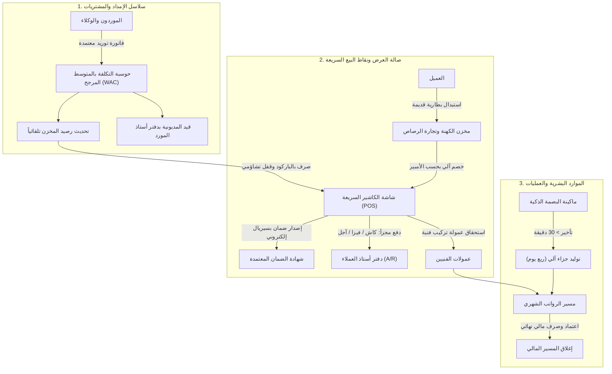

# 🏢 وثيقة الجودة البرمجية المعتمدة | Al-Husseini ERP & POS Systems
## 📘 المرجع التشغيلي الموحد لمهندسي فحص البرمجيات (QA & Test Execution Master Manual)

---

| **بيانات الوثيقة** | **التفاصيل والمعايير** |
|:---|:---|
| **كود الوثيقة (Document Ref):** | `QA-DOC-ALHUSSEINI-2026-V2` |
| **اسم المشروع:** | نظام إدارة مجموعة الحسيني لتجارة البطاريات والزيوت والموارد البشرية |
| **الإصدار الحالي (Version):** | `2.5 - Production Ready` |
| **تاريخ التحديث الأخير:** | 24 سبتمبر 2026 |
| **الفرع التشغيلي محل الفحص:** | `فرع دمياط الجديدة - شارع المحجوب` (كود: `MAIN`) |
| **الجمهور المستهدف:** | مهندسو توكيد الجودة (QA Engineers) / محللو النظم / مهندسو الاختبار (Testers) |
| **تصنيف السرية:** | مستند داخلي تقني معتمد - خاص بفريق الفحص والتطوير |

---

## 📑 فهرس محتويات الدليل التشغيلي

```
1.0 ملخص المنظومة ونطاق العمل (System Context & Operational Scope)
    1.1 طبيعة النظام وهيكل الأعمال
    1.2 دورة تدفق العمليات المتكاملة (Integrated Workflow)
2.0 إعداد بيئة الفحص وحسابات التجربة (Test Environment & Personas)
    2.1 خطوات تجهيز البيانات التجريبية النظيفة
    2.2 جدول الحسابات والأدوار الاختبارية
    2.3 أكواد تفويض الإدارة العليا (Manager Overrides)
3.0 الدستور المحاسبي والتشغيلي للنظام (Business Invariants & Formulas)
    3.1 معادلة البيع والخصم الإجباري للكهنة (Scrap Ah Pricing)
    3.2 معادلة المتوسط المرجح لتقييم المخزون (WAC Engine)
    3.3 لوائح محرك الحضور وفترات التبريد والجزاء الآلي
    3.4 لوائح مسيرات الرواتب الشهرية وصافي المستحقات
4.0 خريطة الشاشات والمسارات للفحص (System Sitemap & Testing Routes)
5.0 جدول مصفوفة سيناريوهات الاختبار التفصيلية (Step-by-Step Test Cases)
    5.1 سيناريوهات المبيعات ونقاط البيع (POS & Cashier Tests)
    5.2 سيناريوهات التوريدات وتقييم المخزون (Purchasing & WAC Tests)
    5.3 سيناريوهات الضمانات والاستبدال الفوري (Warranties & RMA Tests)
    5.4 سيناريوهات الموارد البشرية والرواتب (HR & Payroll Tests)
    5.5 سيناريوهات محرك البحث الشامل والتطبيع اللغوي (Spotlight Tests)
6.0 جدول الخطوط الحمراء والأخطاء الحرجة (Red Flags & Critical Defects)
7.0 حزمة الاختبارات المؤتمتة وأدوات التحقق (Automation & Log Inspection)
8.0 نموذج الإبلاغ المعتمد عن العيوب (Standard Defect Report Template)
```

---

## 1.0 ملخص المنظومة ونطاق العمل (System Context & Operational Scope)

### 1.1 طبيعة النظام وهيكل الأعمال
نظام مجموعة الحسيني هو حل مؤسسي متكامل (**ERP & POS**) يجمع بين إدارة المبيعات اللحظية، والورش الفنية، والمخازن، وسلاسل الإمداد، وإدارة عملاء الآجل، وشؤون الموظفين، في مركز موحد لخدمات وتجارة:
* **بطاريات السيارات بكافة أنواعها وسعاتها (Chloride, Varta, ACDelco, Hankook وغيرها).**
* **زيوت المحركات، الفلاتر، والشحوم وسوائل التبريد.**
* **خدمات الكشف بالكمبيوتر، فحص الدينامو والمارش، والصيانة السريعة.**
* **تجارة رصاص وبطاريات الكهنة المستبدلة وإعادة تدويرها.**

### 1.2 دورة تدفق العمليات المتكاملة (Integrated Workflow)



---

## 2.0 إعداد بيئة الفحص وحسابات التجربة (Test Environment & Personas)

### 2.1 خطوات تجهيز البيانات التجريبية النظيفة (Database Refresh)
لضمان مطابقة بيئة الفحص مع المعايير القياسية للمشروع، قم بتنفيذ الأوامر التالية من سطر الأوامر (Terminal):
```bash
# 1. مسح قاعدة البيانات وإعادة بنائها وتحميل بيانات البذور التجريبية
php artisan migrate:fresh --seed

# 2. مسح ملفات الكاش المؤقتة
php artisan optimize:clear
```

### 2.2 جدول الحسابات والأدوار الاختبارية (Test Personas)

| الشخصية الاختبارية | البريد الإلكتروني | كلمة المرور | الدور والصلاحيات | نطاق شاشات الفحص المسموحة |
|:---|:---|:---:|:---|:---|
| **مدير النظام العام (Super Admin)** | `admin@alhusseini.com` | `12345678` | دور `super-admin` | حق الوصول المطلق لكافة الشاشات، العمليات المالية، والتقارير. |
| **المحاسب والكاشير (Accountant / Cashier)** | `accountant@alhusseini.com` | `12345678` | دور `accountant` | نقطة البيع (POS)، فواتير المشتريات، كشوف الحسابات، وسندات القبض. |
| **مدير الفرع (Branch Manager)** | حساب تجريبي / مدير | `12345678` | دور `branch_manager` | فحص شاشات اعتماد الرواتب، وتفويض تجاوز سقف ائتمان العملاء. |
| **مستخدم غير مصرح (Unauthorized Guest)** | إنشاء حساب جديد | `12345678` | بدون أدوار مسندة | التحقق من ظهور شاشة المنع الرسمية `403 Forbidden`. |

### 2.3 أكواد تفويض الإدارة العليا (Manager Overrides)
عند قيام الكاشير بعملية بيع بالآجل تتجاوز سقف الائتمان المسموح للعميل (`credit_limit`)، يتوقف النظام ويشترط إدخال كود المدير:
* **الكود التجريبي المعتمد:** `mgr_override_99` أو `9999`.
* أو كلمة مرور أي مستخدم يحمل أحد الأدوار: `admin` أو `manager` أو `branch_manager`.

---

## 3.0 الدستور المحاسبي والتشغيلي للنظام (Business Invariants & Formulas)

> [!IMPORTANT]
> **قاعدة حتمية لا تقبل الاستثناء:** هذه القواعد والمعادلات مبرمجة في صميم محرك النظام؛ أي تفاوت في نتائجها يُعد خطأً حرجاً (Critical Bug).

### 3.1 معادلة البيع والخصم الإجباري للكهنة (POS & Scrap Pricing)

$$\mathbf{\text{الصافي النهائي}} = (\text{الإجمالي الفرعي} + \text{الضريبة}) - (\text{الخصم التجاري} + \text{خصم الكهنة})$$

* **ضوابط خصم بطاريات الكهنة (Scrap Zero-Tampering Policy):**
  1. يُحظر على الكاشير إدخال قيمة خصم الكهنة يدوياً (الحقل للقراءة فقط `readonly`).
  2. بمجرد اختيار سعة الأمبير للبطارية القديمة من القائمة، تُجلب القيمة حصراً من جدول الشرائح `scrap_pricing_tiers`:
     * سعة 40Ah إلى 55Ah = **450.00 ج.م**.
     * سعة 60Ah إلى 70Ah = **600.00 ج.م**.
     * سعة 74Ah إلى 80Ah = **750.00 ج.م**.
     * سعة 90Ah إلى 100Ah = **1,000.00 ج.م**.
  3. تُودع البطارية القديمة تلقائياً في مخزن الكهنة (`scrap_batteries_inventory`) مع احتساب وزن الرصاص التقديري:
     $$\text{وزن الرصاص بالكيلوجرام} = \text{سعة الأمبير} \times 0.17$$
     *(مثال: بطارية 70Ah ينتج عنها $70 \times 0.17 = 11.90\text{ كجم}$ رصاص خام).*

---

### 3.2 معادلة المتوسط المرجح لتقييم المخزون (Weighted Average Cost - WAC)

مع كل شحنة توريد جديدة من أي مورد، تُعاد حوسبة تكلفة وحدة المنتج فورياً داخل جدول `products`:

$$\mathbf{\text{WAC الجديد}} = \frac{(\text{الرصيد المتبقي بالمخزن} \times \text{سعر التكلفة الحالي}) + (\text{الكمية الواردة الجديدة} \times \text{سعر التوريد الجديد})}{\text{إجمالي الكمية بعد التوريد}}$$

* **مثال تطبيقي للتحقق منه في الفحص:**
  * رصيد المخزن الحالي لبطارية معينة: 10 قطع | التكلفة الحالية للقطعة: 2,000.00 ج.م (القيمة = 20,000 ج.م).
  * فاتورة توريد جديدة: 10 قطع | سعر الشراء الجديد: 2,600.00 ج.م (القيمة = 26,000 ج.م).
  * الناتج المحاسبي الإلزامي للنظام:
    $$\text{التكلفة الجديدة} = \frac{20,000 + 26,000}{10 + 10} = \frac{46,000}{20} = \mathbf{2,300.00\text{ ج.م}}$$
  * الرصيد المخزني يصبح: 20 قطعة | تكلفة الوحدة تصبح: 2,300.00 ج.م.

---

### 3.3 لوائح محرك الحضور وفترات التبريد والجزاء الآلي (Strict Attendance)

| الحالة التشغيلية | المعيار الزمني المحدد | الإجراء البرمجي التلقائي للنظام |
|:---|:---|:---|
| **حضور في الميعاد أو فترة السماح** | خلال 15 دقيقة من بداية الشفت (مثلاً 09:00 حتى 09:15) | تسجيل الحالة `present` بدون احتساب أي دقائق تأخير. |
| **فترة التبريد (5-Min Anti-Passback)** | بصمة ثانية لنفس الموظف خلال أقل من 5 دقائق من الأولى | إهمال البصمة الثانية تماماً وتثبيت توقيت البصمة الأولى لمنع تكرار البصمة العرضي. |
| **محاولة حضور مكرر بعد 5 دقائق** | تسجيل بصمة حضور ثانية بعد مرور أكثر من 5 دقائق | رفض العملية ورمي استثناء: `الموظف مسجل حضور بالفعل اليوم في تمام الساعة (XX:XX)`. |
| **تأخير يتجاوز 30 دقيقة** | الحضور بعد الشفت بـ 31 دقيقة أو أكثر | تحويل الحالة إلى `late` + توليد خصم آلي بقيمة ربع يوم عمل: $\text{الخصم} = \frac{\text{الأساسي}}{30} \times 0.25$. |
| **الانصراف قبل الحضور** | محاولة تسجيل انصراف لموظف لم يحضر أو في وقت يسبق حضوره | حظر العملية فورياً برمي استثناء صريح. |

---

### 3.4 لوائح مسيرات الرواتب الشهرية وصافي المستحقات (HR Payroll Rules)

$$\mathbf{\text{صافي الراتب}} = (\text{الأساسي} + \text{البدلات} + \text{عمولات التركيب الفنية} + \text{الإضافي}) - (\text{تكلفة الغياب} + \text{الجزاءات المعتمدة})$$

1. **حتمية الصافي الإيجابي (Non-Negative Floor):**
   * لا يمكن لصافي الراتب أن يهبط تحت الصفر مهما بلغت خصومات أو غياب الموظف؛ يُطبق النظام إجبارياً: `max(0, net)`.
2. **عمولات الفنيين:**
   * كل بطارية يتم تركيبها بواسطة الفني في فاتورة البيع تمنحه عمولة تركيب محددة (25.00 ج.م) تُرحل تلقائياً لمسير راتبه الشهري.
3. **الدورة الثلاثية لمسير الرواتب:**
   * مسودة (`draft`) $\rightarrow$ اعتماد إداري بالاسم (`approved`) $\rightarrow$ صرف مالي وتجميد القيود نهائياً (`disbursed`).

---

## 4.0 خريطة الشاشات والمسارات للفحص (System Sitemap & Testing Routes)

```
[لوحة التحكم الرئيسية]
  │
  ├── 🔍 البحث العالمي الشامل (Ctrl + K) ───> [/admin/global-search]
  │
  ├── 🛒 قطاع المبيعات ونقاط البيع (POS)
  │     ├── شاشة الكاشير السريعة ────────────> [/admin/pos]
  │     ├── سجل فواتير المبيعات ───────────────> [/admin/invoices]
  │     ├── معاينة وطباعة الإيصال الحراري ───> [/admin/pos/{id}/receipt]
  │     └── إدارة حسابات عملاء الآجل ────────> [/admin/credit]
  │
  ├── 📦 قطاع التوريدات والمشتريات
  │     ├── سجل فواتير المشتريات ────────────> [/admin/purchases]
  │     ├── إنشاء فاتورة توريد جديدة ─────────> [/admin/purchases/create]
  │     ├── ملفات الموردين وكشوف الحسابات ───> [/admin/suppliers]
  │     └── كشف أستاذ المورد وسندات الصرف ───> [/admin/suppliers/{id}/ledger]
  │
  ├── 🛡️ قطاع الضمانات ومخزن الكهنة
  │     ├── شاشة فحص سريان الضمان بالسيريال ──> [/admin/warranties/verify]
  │     ├── سجل الضمانات وتذاكر الاستبدال ───> [/admin/warranties]
  │     └── مخزن بطاريات الكهنة وتجارة الرصاص ─> [/admin/scrap-inventory]
  │
  └── 👥 قطاع شؤون الموظفين والعمليات (HR)
        ├── دليل وبطاقات الموظفين ───────────> [/admin/hr/employees]
        ├── شاشة الحضور والانصراف والبصمة ───> [/admin/hr/attendance]
        ├── سجل الجزاءات والخصومات ──────────> [/admin/hr/deductions]
        ├── مسير الرواتب الشهري المعتمد ─────> [/admin/hr/payroll]
        └── تقارير الموارد البشرية والطباعة ─> [/admin/hr/reports]
```

---

## 5.0 جدول مصفوفة سيناريوهات الاختبار التفصيلية (Step-by-Step Test Cases)

---

### 5.1 سيناريوهات المبيعات ونقاط البيع (POS & Cashier Tests)

| كود الاختبار | الشاشة والمسار | الإجراء والبيانات المدخلة | السلوك والنتيجة المتوقعة | الأولوية |
|:---:|:---|:---|:---|:---:|
| **TC-POS-01** | نقطة البيع<br>`/admin/pos` | بيع بطارية نقداً (Cash) بسعر 3200 ج.م وإدخال سيريال جديد `CHL-TEST-001`. | - خصم قطعة من المخزن فوراً.<br>- إصدار شهادة ضمان نشطة بالسيريال لـ 12 شهراً.<br>- حالة الفاتورة `paid` والمتبقي 0. | **P1 - Critical** |
| **TC-POS-02** | نقطة البيع<br>`/admin/pos` | محاولة سداد فاتورة 3000 ج.م بدفع مجزأ غير متطابق (1000 كاش + 1000 فيزا + 500 آجل). | رفض الفاتورة ومنع الحفظ مع رسالة: `إجمالي مبالغ الدفع لا يتطابق مع صافي الفاتورة`. | **P1 - Critical** |
| **TC-POS-03** | نقطة البيع<br>`/admin/pos` | تفعيل استبدال بطارية قديمة بسعة `70Ah` واختيار فني صيانة. | - خصم 600 ج.م آلياً من الإجمالي.<br>- إيداع بطارية بمخزن الكهنة وحساب وزن الرصاص 11.9 كجم.<br>- استحقاق عمولة 25 ج.م للفني. | **P1 - Critical** |
| **TC-POS-04** | نقطة البيع<br>`/admin/pos` | بيع بالآجل لعميل يتجاوز سقف ائتمانه بدون كود المدير. | منع الفاتورة وظهور حقل يطلب كود المدير. عند إدخال `mgr_override_99` تكتمل الفاتورة بنجاح. | **P1 - Critical** |
| **TC-POS-05** | فواتير المبيعات<br>`/admin/invoices` | تقديم طلب مرتجع (Return) لفاتورة مباعة بالآجل تحتوي بطارية وضمان. | - عودة رصيد البطارية للمخزن.<br>- إلغاء وثيقة الضمان (`cancelled`).<br>- تخفيض مديونية العميل بقيمة المرتجع. | **P2 - High** |

---

### 5.2 سيناريوهات التوريدات وتقييم المخزون (Purchasing & WAC Tests)

| كود الاختبار | الشاشة والمسار | الإجراء والبيانات المدخلة | السلوك والنتيجة المتوقعة | الأولوية |
|:---:|:---|:---|:---|:---:|
| **TC-PUR-01** | فواتير الشراء<br>`/admin/purchases/create` | توريد 10 بطاريات بسعر 2600 ج.م لمنتج رصيده 10 قطع وتكلفته الحالية 2000 ج.م. | - الرصيد يصبح 20 قطعة.<br>- التكلفة `cost_price` تتحدث إلى **2300.00 ج.م** بالضبط وفق معادلة WAC. | **P1 - Critical** |
| **TC-PUR-02** | كشف أستاذ المورد<br>`/admin/suppliers/{id}/ledger` | تسجيل سند صرف ونقدية لمورد بمبلغ 5,000 ج.م من أصل مديونية 15,000 ج.م. | انخفاض مديونية المورد إلى 10,000 ج.م وقيد سطر سداد بنوع `payment` يوضح الأرصدة قبل وبعد. | **P2 - High** |

---

### 5.3 سيناريوهات الضمانات والاستبدال الفوري (Warranties & RMA Tests)

| كود الاختبار | الشاشة والمسار | الإجراء والبيانات المدخلة | السلوك والنتيجة المتوقعة | الأولوية |
|:---:|:---|:---|:---|:---:|
| **TC-WAR-01** | فحص الضمان<br>`/admin/warranties/verify` | إدخال رقم سيريال بطارية سارية، ثم تجربة سيريال غير مسجل. | - السيريال الصحيح: ظهور كارت الضمان الأخضر بكافة التفاصيل.<br>- السيريال الخاطئ: ظهور تنبيه بعدم وجود ضمان ساري. | **P2 - High** |
| **TC-WAR-02** | الضمانات وتذاكر الاستبدال<br>`/admin/warranties` | فتح تذكرة استبدال فوري لبطارية معيبة وثبت تلفها في الفحص. | - صرف بطارية بديلة من المخزن وإصدار ضمان مستقل جديد لها.<br>- إنشاء مطالبة في `warranty_claims` لمطالبة الوكيل. | **P1 - Critical** |

---

### 5.4 سيناريوهات الموارد البشرية والرواتب (HR & Payroll Tests)

| كود الاختبار | الشاشة والمسار | الإجراء والبيانات المدخلة | السلوك والنتيجة المتوقعة | الأولوية |
|:---:|:---|:---|:---|:---:|
| **TC-HR-01** | الحضور والانصراف<br>`/admin/hr/attendance` | تسجيل بصمة حضور في 09:00 ثم بصمة أخرى لنفس الموظف في 09:02 (فترة التبريد). | قبول البصمة الأولى وتجاهل الثانية مع الحفاظ على وقت الحضور `09:00`. | **P2 - High** |
| **TC-HR-02** | الحضور والانصراف<br>`/admin/hr/attendance` | محاولة تسجيل بصمة حضور ثانية لنفس الموظف بعد مرور ساعة من البصمة الأولى. | رفض العملية وإظهار رسالة: `الموظف مسجل حضور بالفعل اليوم`. | **P2 - High** |
| **TC-HR-03** | الحضور والانصراف<br>`/admin/hr/attendance` | تسجيل بصمة حضور لموظف في 09:40 (تأخير 40 دقيقة مع فترة سماح 15 دقيقة). | تسجيل الحالة `late` وتوليد قيد جزاء آلي بخصم ربع يوم عمل (`multiplier = 0.25`) في سجل الخصومات. | **P1 - Critical** |
| **TC-HR-04** | الحضور والانصراف<br>`/admin/hr/attendance` | محاولة تسجيل انصراف لموظف لم يحضر اليوم، أو انصراف في وقت يسبق الحضور. | حظر المحاولة ورمي استثناء يمنع تسجيل حركة غير منطقية زمنياً. | **P2 - High** |
| **TC-HR-05** | مسير الرواتب<br>`/admin/hr/payroll` | توليد مسير رواتب الشهر لفرع دمياط واعتماده ثم صرفه مالياً. | - تجميع الراتب + البدلات + العمولات - الخصومات بدقة.<br>- تجميد المسير بعد الصرف ومنع تعديله نهائياً. | **P1 - Critical** |
| **TC-HR-06** | مسير الرواتب<br>`/admin/hr/payroll` | اختبار موظف تجاوزت خصوماته وقيمة غيابه راتبه الأساسي بالكامل. | صافي الراتب يستقر عند `0.00 ج.م` ولا يهبط لأي قيمة سالبة إطلاقاً. | **P1 - Critical** |

---

### 5.5 سيناريوهات محرك البحث الشامل والتطبيع اللغوي (Spotlight Tests)

| كود الاختبار | مدخل البحث التجريبي | السجل المستهدف بقاعدة البيانات | النتيجة المتوقعة عبر اختصار `Ctrl + K` | الأولوية |
|:---:|:---|:---|:---|:---:|
| **TC-SCH-01** | `احمد` (ألف مجردة) | `المهندس أحمد الحسيني` | ظهور السجل في قائمة الموظفين بنجاح. | **P2 - High** |
| **TC-SCH-02** | `إبراهيم` (همزة مكسورة) | `محمود ابراهيم الدسوقي` (ألف وصل) | معالجة الهمزة وظهور النتيجة فوراً. | **P2 - High** |
| **TC-SCH-03** | `فارته` (تاء مربوطة/هاء) | `بطارية فارتا بلو ديناميك` | ظهور البطارية في قطاع المنتجات. | **P2 - High** |
| **TC-SCH-04** | `على` (ألف مقصورة) | `علي حسن الشرقاوي` (ياء منقوطة) | العثور على الموظف وعرض بطاقته. | **P2 - High** |
| **TC-SCH-05** | `010-1111-1111` (رموز وفواصل) | `01011111111` | تنظيف الرموز والعثور على العميل فورياً. | **P2 - High** |

---

## 6.0 جدول الخطوط الحمراء والأخطاء الحرجة (Red Flags & Critical Defects)

إذا ظهر لك أي من الأعراض التالية أثناء الفحص، يتم إيقاف الاختبار وفتح **تذكرة خلل حرج (Blocker Bug)**:

```
❌ ظهور شاشة LazyLoadingViolationException في المتصفح.
   المعنى: تم طلب علاقة برمجية بدون Eager Loading مسبق في الكود، وهذا ممنوع قطعياً.

❌ هبوط كمية أي صنف في المخزن لقيمة سالبة (مثلاً: رصيد -1).
   المعنى: فشل القفل التشاؤمي (Pessimistic Locking) وتجاوز المخزون الفعلي.

❌ إمكانية تعديل سعر الكهنة القديمة يدوياً من واجهة الكاشير.
   المعنى: ثغرة تسمح بالتلاعب في أموال المجموعة دون الالتزام بجدول الأمبير.

❌ تفاوت مجموع مبالغ الدفع المجزأ عن صافي الفاتورة وقبول الحفظ.
   المعنى: خلل جسيم في توازن القيد المحاسبي للفاتورة.

❌ هبوط صافي راتب الموظف في مسير الرواتب لأي رقم سالب تحت الصفر.
   المعنى: كسر لقاعدة حتمية الأجر الإيجابي (max(0, net)).

❌ استمرار محاولات فك قفل الشاشة بعد المحاولة الخامسة بدون حظر.
   المعنى: تعطل جدار الحماية ضد التخمين (Rate Limiting).
```

---

## 7.0 حزمة الاختبارات المؤتمتة وأدوات التحقق (Automation & Log Inspection)

### 7.1 تشغيل الاختبارات الآلية (Pest Test Suite):
يحتوي النظام على **126 اختباراً مؤتمتاً** تغطي كافة العمليات والسيناريوهات. يمكنك تشغيلها من الطرفية:

```bash
# تشغيل كامل جناح الاختبارات (يجب أن تظهر النتيجة: 126 passed)
php artisan test

# تشغيل اختبارات المبيعات والتوريدات حصراً
php artisan test --filter=SalesAndPurchases

# تشغيل اختبارات الموارد البشرية والرواتب
php artisan test --filter=HrSubsystemTest

# تشغيل اختبارات الحالات الحدية (فبراير، الصافي فوق الصفر، تكرار البصمة)
php artisan test --filter=HrEdgeCasesTest

# تشغيل اختبارات الضغط العالي (معالجة 50 موظفاً و1000 حركة بصمة واحتساب المسير)
php artisan test --filter=HrVolumeAndStressTest

# تشغيل اختبارات محرك البحث والتطبيع اللغوي العربي
php artisan test --filter=GlobalSearchTest
```

### 7.2 مراقبة سجلات الأخطاء في السيرفر (Server Error Logs):
```powershell
# قراءة آخر 50 سطراً في سجل أخطاء لارافيل عبر PowerShell
Get-Content storage/logs/laravel.log -Tail 50
```

---

## 8.0 نموذج الإبلاغ المعتمد عن العيوب (Standard Defect Report Template)

عند رصد أي مشكلة برمجية، يُرجى استخدام هذا النموذج القياسي لرفع التقرير:

```markdown
### 🐞 [عنوان الخلل المختصر]: وصف دقيق للمشكلة في سطر واحد

* **كود الحالة الاختبارية المرتبطة:** (مثال: TC-POS-03)
* **درجة الخطورة (Severity):** [ 🔴 Blocker | 🟠 Critical | 🟡 Major | ⚪ Minor ]
* **الأولوية في الحل (Priority):** [ P1 - فوري | P2 - هام | P3 - عادي ]
* **المسار والشاشة:** (مثال: `/admin/pos` - شاشة الكاشير)
* **المستخدم والفرع:** (مثال: كاشير الفرع الرئيسي - دمياط الجديدة)

#### 📝 خطوات إعادة إنتاج الخلل (Steps to Reproduce):
1. الانتقال إلى شاشة كذا...
2. إدخال القيمة كذا في حقل...
3. الضغط على زر اعتماد...

#### 🔍 النتيجة الفعلية المرصودة (Actual Result):
ظهور خطأ 500 في السيرفر أو احتساب قيمة خصم غير مطابقة للشريحة.

#### 🎯 النتيجة المتوقعة محاسبياً وتقنياً (Expected Result):
رفض العملية برسالة خطأ توضح سبب المنع مع عدم تغيير المخزون.

#### 📋 السجلات المرفوعة (Log Traceback):
```
[2026-09-24 10:45:00] local.ERROR: Illuminate\Database\LazyLoadingViolationException...
```
