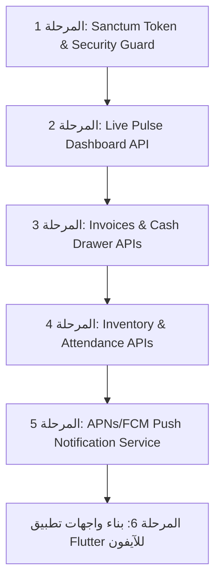

# 📱 خطة معمارية شاملة: تطبيق المالك للمراقبة والمتابعة عن بُعد
## Executive Owner Mobile App (iOS / Flutter API Architecture)

---

## 🎯 1. الرؤية وهوية المستخدم (User Persona & Vision)

* **المستخدم المستهدف**: صاحب المنشأة / المدير العام (Business Owner / General Manager).
* **مكان الاستخدام**: من المنزل، أثناء السفر، أو أثناء التنقل من خلال هاتف **iPhone** أو **Android**.
* **الهدف الجوهري**: تطبيق متابعة ورصد حي (Live Pulse & Surveillance) لنشاط "مركز الحسيني" لحظة بلحظة.
* **فلسفة الصلاحيات والأمان (Zero-Disruption Principle)**:
  * **صلاحيات قراءة ومراقبة تنفيذية فقط (Read-Only Executive Scope)**.
  * لا يحتوي التطبيق على شاشات لإنشاء فواتير كاشير أو تعديل أسعار أو حذف سجلات، لحماية المنشأة 100% حتى لو فُقد الهاتف أو وقع في يد شخص آخر.
  * يعطي المالك الخلاصة الدقيقة الصافية بأقصى سرعة استجابة (< 50ms) وبأقل استهلاك لباقة الإنترنت.

---

## 🔒 2. معمارية الأمان والمصادقة (Authentication & Security)

```
[iPhone App / Flutter]
         │  (HTTPS + JSON)
         ▼
[Rate Limiter: 60 req/min]
         │
[Sanctum Auth Guard: tokenCan('owner-monitor')]
         │
[Owner API Gateway: /api/v1/owner/*]
         │
[Executive Read Services & JsonResources]
         │
[MySQL Database / Redis Cache]
```

* **نظام المصادقة**: Laravel Sanctum مع تخصيص `Token Ability` باسم `['owner-monitor']`.
* **معدل الطلبات (Rate Limiting)**: 60 طلب في الدقيقة لكل جهاز لحماية الخادم من الاستنزاف.
* **التشفير والـ Headers**:
  * `Authorization: Bearer <token>`
  * `Accept: application/json`
  * `Content-Type: application/json`

---

## 📡 3. مواصفات الـ APIs ونماذج البيانات (Endpoints & JSON Contracts)

### أ. المصادقة وإدارة الجهاز (Authentication & Device)

#### `POST /api/v1/owner/auth/login`
* **الوظيفة**: تسجيل دخول المالك وإصدار Token مخصص.
* **المدخلات**: `phone_or_email`, `password`, `device_name`.
* **المخرجات**:
```json
{
  "status": "success",
  "data": {
    "token": "1|qW8e7...owner_secret_token",
    "user": {
      "id": 1,
      "name": "المدير العام",
      "phone": "010xxxxxxxx",
      "role": "owner"
    }
  }
}
```

#### `POST /api/v1/owner/auth/device-token`
* **الوظيفة**: تسجيل معرّف الجهاز (APNs / FCM) لإرسال الإشعارات اللحظية الحساسة.
* **المدخلات**: `fcm_token`, `platform: "ios" | "android"`.

---

### ب. شاشة نبض المركز الحية (Live Pulse Dashboard)

#### `GET /api/v1/owner/dashboard/live`
* **الوظيفة**: الشاشة الرئيسية الأولى التي تفتح فور تشغيل التطبيق، تعطي نبض المحل الآن.
* **المخرجات (استجابة فائقة السرعة < 50ms)**:
```json
{
  "status": "success",
  "timestamp": "2026-10-07T21:45:00+03:00",
  "data": {
    "safe_cash_now": {
      "raw": 34850.00,
      "formatted": "34.85 ألف ج.م",
      "label": "الكاش الفعلي في الخزينة الآن"
    },
    "sales_today": {
      "raw": 42100.00,
      "formatted": "42.1 ألف ج.م",
      "invoices_count": 28,
      "compared_to_yesterday": "+14.5%"
    },
    "active_shift": {
      "is_open": true,
      "cashier_name": "محمود إبراهيم",
      "opened_at": "09:00 ص",
      "duration_hours": "8 ساعات و 45 دقيقة"
    },
    "workshop_attendance": {
      "present_count": 5,
      "total_employees": 6,
      "attendance_rate": "83%"
    },
    "critical_alerts": {
      "low_stock_count": 8,
      "returns_today_count": 1,
      "unsettled_credit_count": 12
    }
  }
}
```

#### `GET /api/v1/owner/dashboard/periods?period={today|week|month|year|all}`
* **الوظيفة**: مقارنة أداء المبيعات بين الفترات (اليوم، الأسبوع، الشهر، العام، الكل) باستخدام التنسيق المالي المختصر والـ Tooltip الدقيق.

---

### ج. شريط حركة الفواتير الحية (Live Invoices Feed)

#### `GET /api/v1/owner/sales/recent-invoices?page=1&per_page=20`
* **الوظيفة**: متابعة الفواتير التي تصدر في المحل أولاً بأول.
* **المخرجات**:
```json
{
  "status": "success",
  "data": [
    {
      "id": 1450,
      "invoice_number": "INV-261007-0028",
      "time": "08:15 م",
      "customer_name": "أحمد فتحي (نقدي)",
      "cashier_name": "محمود إبراهيم",
      "final_amount": {
        "raw": 3200.00,
        "formatted": "3,200 ج.م"
      },
      "items_count": 2,
      "payment_method": "cash",
      "payment_status": "paid",
      "has_warranty": true
    }
  ],
  "pagination": { "current_page": 1, "has_more": true }
}
```

#### `GET /api/v1/owner/sales/invoices/{id}`
* **الوظيفة**: عرض الفاتورة بالكامل عند الضغط عليها (الأصناف المباعة، الضمانات الممنوحة، تفاصيل الخصم أو السكراب).

#### `GET /api/v1/owner/sales/returns`
* **الوظيفة**: تقرير فوري بمرتجعات اليوم وبنودها (لأغراض الرقابة الإدارية).

---

### د. الخزينة والورديات (Cash Drawer & Shift Surveillance)

#### `GET /api/v1/owner/cash-drawer/current-shift`
* **الوظيفة**: مراقبة درج الكاشير للوردية المفتوحة حالياً قبل تقفيل الحساب.
* **المخرجات**:
```json
{
  "status": "success",
  "data": {
    "cashier_name": "محمود إبراهيم",
    "opening_balance": 500.00,
    "cash_sales": 32400.00,
    "card_sales": 6500.00,
    "instapay_sales": 3200.00,
    "credit_collections_cash": 1950.00,
    "expenses_paid": 400.00,
    "expected_drawer_cash": 34450.00
  }
}
```

---

### هـ. تنبيهات النواقص والمخزون (Inventory Health Alerts)

#### `GET /api/v1/owner/inventory/alerts`
* **الوظيفة**: قائمة بالأصناف التي وصلت لحد إعادة الطلب (`current_stock <= reorder_threshold`).
* **المخرجات**:
```json
{
  "status": "success",
  "data": [
    {
      "id": 12,
      "name": "بطارية كلورايد 70 أمبير جولد",
      "sku": "BAT-CHL-70G",
      "current_stock": 2,
      "reorder_threshold": 5,
      "cost_price": "2,000 ج.م",
      "status": "critical_low"
    }
  ]
}
```

---

### و. فريق العمل وحضور الورشة اليوم (Staff & Workshop Attendance)

#### `GET /api/v1/owner/staff/today-attendance`
* **الوظيفة**: معرفة من يتواجد في المحل والورشة في هذه اللحظة.
* **المخرجات**:
```json
{
  "status": "success",
  "data": [
    {
      "employee_id": 1,
      "name": "عصام",
      "role": "مدير المحل / فني رئيسي",
      "status": "present",
      "check_in_time": "09:05 ص",
      "late_minutes": 5
    },
    {
      "employee_id": 2,
      "name": "حسام علاء",
      "role": "قسم الزيت",
      "status": "present",
      "check_in_time": "09:30 ص",
      "late_minutes": 30
    },
    {
      "employee_id": 3,
      "name": "أمير محمد",
      "role": "عامل نظافة وتجهيز",
      "status": "absent",
      "check_in_time": null
    }
  ]
}
```

---

### ز. ديون العملاء والتحصيلات (Credit & Receivables Pulse)

#### `GET /api/v1/owner/credit/overview`
* **الوظيفة**: إجمالي الأموال المعلقة في السوق وكبار المدينين.
* **المخرجات**:
  * إجمالي الآجل الحالي المعلق (`total_debt`).
  * تحصيلات الآجل المستلمة اليوم (`collected_today`).
  * قائمة أعلى 5 عملاء عليهم مديونيات للتواصل معهم.

---

### ح. تنبيهات الإشعارات الفورية للآيفون (Push Notifications Triggers)

يتم إرسال إشعار فوري (Push Notification) لهاتف المالك عبر APNs / Firebase في الحالات التالية:
1. **إغلاق وردية الكاشير**: تقرير فوري بنهاية اليوم (إجمالي المبيعات، العجز أو الزيادة في الدرج).
2. **فاتورة استثنائية (High-Value Sale)**: فاتورة مبيعات تتجاوز 15,000 ج.م.
3. **تسجيل مرتجع بضاعة (Return Audit)**: تنبيه لحظي عند قيام الكاشير برد بضاعة أو إرجاع أموال للعميل.
4. **تنبيه نفاد صنف حيوي**: نفاد مخزون بطارية أساسية أو زيت مطلوب.

---

## 🗺️ 4. خريطة طريق التنفيذ البرمجي (Implementation Roadmap)



### الهيكل البرمجي المقترح في Laravel:
```
app/
├── Http/
│   ├── Controllers/
│   │   └── Api/
│   │       └── V1/
│   │           └── Owner/
│   │               ├── AuthController.php
│   │               ├── DashboardController.php
│   │               ├── SalesController.php
│   │               ├── CashDrawerController.php
│   │               ├── InventoryController.php
│   │               ├── StaffController.php
│   │               └── CreditController.php
│   └── Resources/
│       └── Api/
│           └── V1/
│               └── Owner/
│                   ├── LivePulseResource.php
│                   ├── InvoiceSummaryResource.php
│                   ├── AttendanceResource.php
│                   └── AlertResource.php
routes/
└── api_owner.php (أو مدمج داخل routes/api.php)
```

---

## 📋 5. البرومبت الجاهز لإعطائه لـ Claude لبناء الكود فوراً

```markdown
Role: Senior Laravel API Architect.
Project: Al-Husseini Auto Center.
Task: Implement the "Executive Owner Mobile App" REST APIs based on the architectural plan:

1. Setup Routes:
   - File: `routes/api.php` under prefix `api/v1/owner`.
   - Protect all endpoints with `auth:sanctum` and ability check `owner-monitor`.

2. Controllers & Endpoints:
   - `AuthController`: login, logout, profile, register-device-token.
   - `DashboardController`: 
     * `GET /live`: returns today's cash in drawer, sales, invoice count, active shift, attendance rate, and critical alerts.
     * `GET /periods`: returns period stats with compact formatting.
   - `SalesController`: 
     * `GET /recent-invoices`: paginated recent invoices feed.
     * `GET /invoices/{id}`: full details.
     * `GET /returns`: returns log.
   - `CashDrawerController`: 
     * `GET /current-shift`: live cash balance, sales by payment method, expenses.
   - `InventoryController`: 
     * `GET /alerts`: low-stock items (stock <= reorder_threshold).
   - `StaffController`: 
     * `GET /today-attendance`: present, late, absent status.
   - `CreditController`: 
     * `GET /overview`: total market debt, today collections, top indebted customers.

3. Standards:
   - Use dedicated JsonResources for all responses.
   - Keep queries optimized (<50ms execution time).
   - All monetary values must return both raw float and formatted Arabic currency.
   - Output complete, production-ready code with no placeholders.
```
