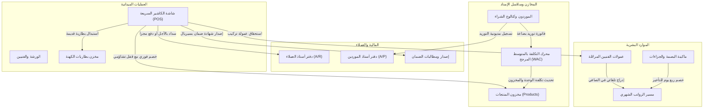

# 🧪 دليل ضمان الجودة واختبار الأنظمة الشامل (QA & Tester Master Manual)
### Al-Husseini Group Management System (ERP & POS)
**مرجع مهندسي الجودة واختبار البرمجيات (Software Quality Assurance & Test Engineers)**

---

> [!NOTE]
> **إصدار التوثيق:** 2.5 | **تاريخ التحديث:** سبتمبر 2026  
> **حالة الاختبارات المؤتمتة:** اجتياز **126/126** اختباراً مؤتمتاً بنسبة **100%** (506 assertions) عبر Pest & PHPUnit.  
> **الفرع التشغيلي محل الفحص:** `فرع دمياط الجديدة` (كود: `MAIN`).

---

## 📑 فهرس محتويات الدليل

1. [نظرة عامة والبيئة التشغيلية (Executive System Context)](#1-نظرة-عامة-والبيئة-التشغيلية)
2. [بيئة الفحص وحسابات الاختبار (Test Personas & Environment Setup)](#2-بيئة-الفحص-وحسابات-الاختبار)
3. [مصفوفة القواعد الحتمية للنظام (Business Invariants - Must Never Break)](#3-مصفوفة-القواعد-الحتمية-للنظام)
4. [مصفوفة حالات الاختبار التشغيلية (Detailed Test Cases Matrix)](#4-مصفوفة-حالات-الاختبار-التشغيلية)
   - [القطاع 1: نقطة البيع والمبيعات (POS & Sales)](#القطاع-1-نقطة-البيع-والمبيعات-pos--sales)
   - [القطاع 2: التوريدات والمشتريات والموردين (Purchasing & Multi-Supplier)](#القطاع-2-التوريدات-والمشتريات-والموردين-purchasing--multi-supplier)
   - [القطاع 3: الضمانات وبطاقات الاستبدال (Warranties & RMA Claims)](#القطاع-3-الضمانات-وبطاقات-الاستبدال-warranties--rma-claims)
   - [القطاع 4: مخزن الكهنة وتجارة الرصاص (Scrap Battery Inventory)](#القطاع-4-مخزن-الكهنة-وتجارة-الرصاص-scrap-battery-inventory)
   - [القطاع 5: شؤون الموظفين والعمليات (HR, Attendance & Payroll)](#القطاع-5-شؤون-الموظفين-والعمليات-hr-attendance--payroll)
   - [القطاع 6: محرك البحث الشامل والتطبيع العربي (Spotlight Search)](#القطاع-6-محرك-البحث-الشامل-والتطبيع-العربي-spotlight-search)
   - [القطاع 7: الأمان ومكافحة الاختراق (Security & Access Control)](#القطاع-7-الأمان-ومكافحة-الاختراق-security--access-control)
5. [دليل الاختبارات المؤتمتة ومؤشرات الجودة (Automated Test Execution)](#5-دليل-الاختبارات-المؤتمتة-ومؤشرات-الجودة)
6. [إرشادات تسجيل وتتبع الأخطاء البرمجية (Defect Reporting Standards)](#6-إرشادات-تسجيل-وتتبع-الأخطاء-البرمجية)

---

## 1. نظرة عامة والبيئة التشغيلية

نظام مجموعة الحسيني هو حل متكامل لتخطيط موارد المؤسسات ونقاط البيع السريعة (**ERP & POS**) مخصص لخدمات وتجارة **بطاريات السيارات، الزيوت، الفلاتر، الصيانة الفنية، والإنقاذ السريع**.

### الهيكل والترابط الوظيفي للمنظومة:



---

## 2. بيئة الفحص وحسابات الاختبار

### أ. إعداد قاعدة بيانات الاختبار المحلية (Local Fresh Setup)
لضمان نظافة البيانات قبل بدء جولة فحص (Test Run):
```bash
# إعادة بناء الجداول وتحميل كافة البيانات التجريبية والفهارس
php artisan migrate:fresh --seed

# مسح الكاش بالكامل
php artisan optimize:clear
```

### ب. جدول حسابات المستخدمين التجريبية (Test User Personas)

| الشخصية الاختبارية (Persona) | البريد الإلكتروني | كلمة المرور الافتراضية | الصلاحيات والدور | الغرض الاختباري |
|---|---|---|---|---|
| **Super Admin** | `admin@alhusseini.com` | `12345678` | دور `super-admin` (تجاوز كامل للـ Gates) | فحص كافة الشاشات والإعدادات والتقارير ومسيرات الرواتب. |
| **Accountant / Cashier** | `accountant@alhusseini.com` | `12345678` | دور `accountant` + صلاحيات الفواتير والـ POS | فحص عمليات البيع، التحصيل، فواتير التوريد، وكشف الحساب. |
| **Branch Manager** | حساب تجريبي أو Super Admin | - | دور `branch_manager` | فحص موافقة تجاوز سقف الائتمان، واعتماد الرواتب. |
| **Unauthorized User** | إنشاء مستخدم بدون Roles | `12345678` | مستخدم عادي مسجل | فحص جدران الحماية (403 Forbidden Response). |

> [!IMPORTANT]
> **أكواد اعتماد موافقة المدير (Manager Override Codes) لتجاوز سقف الائتمان:**
> * لا يوجد كود ثابت داخل النظام. يُضبط سر الموافقة في ملف البيئة عبر `MANAGER_OVERRIDE_CODE_HASH` (مُفضَّل) أو `MANAGER_OVERRIDE_CODE`.
> * إذا لم يُضبط أيٌّ منهما تُرفض جميع طلبات التجاوز. الأكواد القديمة (`9999` و`mgr_override_99`) وكلمات مرور المديرين لم تعد مقبولة.

---

## 3. مصفوفة القواعد الحتمية للنظام (Business Invariants - Must Never Break)

يجب على التيستر التحقق من عدم اختراق هذه القواعد تحت أي ظرف:

1. **الذاتية المالية والقفل التشاؤمي (Pessimistic Locking):**
   * عند إتمام فاتورة مبيعات، تُقفل المنتجات المعنية عبر `lockForUpdate()` لمنع البيع السالب في حالة الضغط المتزامن.
2. **منع مشاكل N+1 في استعلامات الواجهات (Prevent Lazy Loading):**
   * بيئة التطوير مُهيأة لإطلاق `LazyLoadingViolationException` فور استدعاء أي علاقة لم تُحمّل مسبقاً (`with()`). ظهور هذه الشاشة خطأ حرج (Critical Bug).
3. **تسعير استبدال الكهنة الصارم (Zero-Tampering Scrap Pricing):**
   * **ممنوع نهائياً** تعديل قيمة خصم البطارية القديمة يدوياً بواسطة الكاشير. تُحسب القيمة حصراً من جدول شرائح الأمبير المعتمد (`scrap_pricing_tiers`).
4. **تطابق مبالغ الدفع المجزأ (Split Payment Validation):**
   * إجمالي مبالغ الدفع (كاش + فيزا + آجل) يجب أن يطابق تماماً صافي الفاتورة بهامش خطأ لا يتجاوز 0.05 ج.م، وإلا تُرفض الفاتورة باستثناء فوري.
5. **سقف الائتمان (Credit Limit Enforcement):**
   * لا يمكن إضافة رصيد مدين لعميل يتجاوز `credit_limit` الخاص به بدون إدخال كود موافقة المدير الصحيح.
6. **دورة حياة الضمان بالسيريال (Serial & Warranty Binding):**
   * لا تُصدر شهادة ضمان إلا للسلع المعرّفة كـ `is_battery = true` وبشرط إدخال رقم سيريال فريد لحظة البيع.
7. **محرك الحضور الصارم (Attendance Engine):**
   * **تبريد 5 دقائق (Debounce):** أي بصمة خلال 5 دقائق من البصمة الأولى تُعتبر ارتداداً عرضياً وتُهمل دون تعديل وقت الحضور الأول.
   * **منع الحضور المزدوج:** أي بصمة حضور بعد 5 دقائق تُرفض مع رسالة تحذيرية صريحة.
   * **منع الانصراف غير المنطقي:** لا يجوز تسجيل انصراف لموظف لم يحضر، أو في وقت يسبق وقت الحضور.
   * **الجزاء الآلي:** التأخير بعد فترة السماح بمقدار 30 دقيقة أو أكثر يُولد آلياً خصم ربع يوم عمل (`multiplier = 0.25`).
8. **أمان الرواتب وصافي الأجر (Payroll Net Salary Floor):**
   * صافي الراتب بعد الخصومات والغياب لا يجوز أن ينخفض تحت الصفر مطلقاً؛ يُطبق `max(0, net)`.
9. **تقييم المخزون بالمتوسط المرجح (WAC):**
   * مع كل فاتورة توريد شحنة مشتريات، تُعاد حوسبة `cost_price` للمنتج تلقائياً وفق معادلة المتوسط المرجح.

---

## 4. مصفوفة حالات الاختبار التشغيلية (Detailed Test Cases Matrix)

---

### القطاع 1: نقطة البيع والمبيعات (POS & Sales)

#### [TC-POS-01] البيع النقدي البسيط مع خصم المخزون
* **الهدف:** التأكد من إنشاء الفاتورة، خصم الكمية من المخزون، وتسجيل حالة الفاتورة كـ `paid`.
* **المسار:** `admin/pos`
* **الخطوات:**
  1. اختيار عميل عابر أو عميل مسجل.
  2. إضافة بطارية واحدة من نوع `Chloride Gold 70Ah` (رصيدها الحالي 14).
  3. إدخال سيريال افتراضي: `CHL-TEST-001`.
  4. اختيار طريقة الدفع: **نقدي (Cash)** بالمبلغ الكامل.
  5. الضغط على زر "حفظ وطباعة الفاتورة".
* **النتيجة المتوقعة:**
  - إنشاء الفاتورة بنجاح وتحويل المستخدم لصفحة الإيصال الحراري (`admin/pos/{id}/receipt`).
  - رصيد المنتج في جدول `products` ينخفض من 14 إلى 13.
  - إنشاء سجل ضمان برقم السيريال وحالة `active`.
  - حالة الفاتورة `paid` والمتبقي 0.

#### [TC-POS-02] البيع بدفع مجزأ (Split Payment) ومطابقة الصافي
* **الهدف:** التحقق من قبول طرق دفع متعددة في نفس الفاتورة ورفض العملية إذا لم يتطابق المجموع.
* **المسار:** `admin/pos`
* **الخطوات:**
  1. إضافة منتجات بإجمالي 3000 ج.م.
  2. تقسيم الدفع: 1000 كاش + 1000 فيزا + 500 آجل (المجموع 2500 ج.م وهو غير مطابق).
  3. محاولة تأكيد الفاتورة.
  4. تعديل مبلغ الآجل إلى 1000 ج.م (ليصبح المجموع 3000 ج.م بالضبط).
  5. تأكيد الفاتورة.
* **النتيجة المتوقعة:**
  - في الخطوة (3): يرفض النظام العملية مع رسالة خطأ: `إجمالي مبالغ الدفع لا يتطابق مع صافي الفاتورة`.
  - في الخطوة (5): تنجح العملية، وتُسجل 3 سجلات في `invoice_payments` بقيمها وطرقها المختلفة.

#### [TC-POS-03] تجاوز سقف الائتمان واختبار كود المدير (Manager Override)
* **الهدف:** التأكد من منع التداين فوق الحد المسموح إلا بتفويض المدير.
* **المسار:** `admin/pos`
* **الخطوات:**
  1. اختيار عميل رصيده المدين الحالي 4000 ج.م وسقف ائتمانه 5000 ج.م (المتبقي المسموح به 1000 ج.م).
  2. عمل فاتورة بمبلغ 2500 ج.م بالآجل (سيتجاوز السقف بمقدار 1500 ج.م).
  3. تأكيد الفاتورة دون إدخال كود المدير أو بكود خاطئ `0000`.
  4. إعادة المحاولة مع إدخال كود المدير المُعدّ في بيئة الفحص (`MANAGER_OVERRIDE_CODE_HASH`).
* **النتيجة المتوقعة:**
  - في الخطوة (3): تظهر رسالة منع واضحة: `تم تجاوز سقف الائتمان للعميل، ويلزم إدخال كود موافقة المدير الصحيح للاعتماد`.
  - في الخطوة (4): تكتمل الفاتورة بنجاح، ويصبح رصيد العميل 6500 ج.م مع قيد في `credit_ledger_entries`.

#### [TC-POS-04] استبدال بطارية قديمة (الكهنة Scrap Deduction)
* **الهدف:** التأكد من احتساب خصم الكهنة آلياً وفق شريحة الأمبير وإيداعها في مخزن الكهنة.
* **المسار:** `admin/pos`
* **الخطوات:**
  1. إضافة بطارية جديدة بسعر 3200 ج.م.
  2. تفعيل خيار "استبدال بطارية قديمة (كهنة)".
  3. اختيار سعة البطارية القديمة: `70Ah`.
  4. التحقق من القيمة المحتسبة تلقائياً (مثلاً 600 ج.م حسب شريحة 70Ah).
  5. التأكد من أن حقل قيمة الكهنة للقراءة فقط (Readonly) ولا يقبل الكتابة اليدوية.
  6. إتمام الفاتورة باختيار فني صيانة محدد.
* **النتيجة المتوقعة:**
  - صافي الفاتورة يصبح: 3200 - 600 = 2600 ج.م.
  - إضافة سجل جديد في جدول `scrap_batteries_inventory` بسعة 70Ah، وحالة `in_stock`، واحتساب وزن الرصاص (`70 * 0.17 = 11.9 kg`).
  - تسجيل عمولة تركيب للفني بقيمة 25 ج.م في `technician_commissions` بحالة `pending`.

#### [TC-POS-05] مرتجع فاتورة المبيعات (Sales Return)
* **الهدف:** التأكد من استعادة المخزون، إلغاء بطاقة الضمان، وتعديل حساب الآجل.
* **المسار:** `admin/invoices/{id}`
* **الخطوات:**
  1. فتح فاتورة تحتوي على بطارية بيعت بالآجل مع بطاقة ضمان سارية.
  2. الضغط على زر "طلب مرتجع الفاتورة".
  3. كتابة سبب الإرجاع: "رغبة العميل في استرجاع الصنف".
  4. تأكيد عملية المرتجع.
* **النتيجة المتوقعة:**
  - زيادة رصيد المنتج في المخزن بالكمية المرتجعة فوراً.
  - تحول حالة وثيقة الضمان `Warranty` المرتبطة بالسيريال إلى `cancelled`.
  - تخفيض رصيد مديونية العميل في `credit_ledger_entries` بقيمة المرتجع.
  - تحول حالة الفاتورة إلى `refunded`.

---

### القطاع 2: التوريدات والمشتريات والموردين (Purchasing & Multi-Supplier)

#### [TC-PUR-01] توريد شحنة مشتريات وتحديث التكلفة بالمتوسط المرجح (WAC)
* **الهدف:** التحقق الدقيق من حوسبة WAC لحظياً مع كل شحنة واردة.
* **المسار:** `admin/purchases/create`
* **البيانات الاختبارية:**
  - منتج تجريبي رصيده الحالي = 10 قطع، وتكلفته الحالية = 200.00 ج.م (إجمالي القيمة الحالية = 2000 ج.م).
  - شحنة واردة جديدة: 10 قطع بسعر توريد 260.00 ج.م (إجمالي الشحنة = 2600 ج.م).
* **معادلة الفحص:**
  $$\text{WAC الجديد} = \frac{2000 + 2600}{10 + 10} = \frac{4600}{20} = 230.00 \text{ ج.م}$$
* **الخطوات:**
  1. اختيار المورد وإدخال رقم فاتورة الشحنة `PO-TEST-001`.
  2. إضافة المنتج بالكمية 10 وسعر 260 ج.م.
  3. تأكيد وحفظ الفاتورة.
* **النتيجة المتوقعة:**
  - رصيد المنتج يصبح 20 قطعة.
  - تكلفة المنتج `cost_price` تتحدث إلى 230.00 ج.م بالضبط.
  - تحديث سعر آخر شراء في جدول كتالوج المورد `supplier_products` إلى 260 ج.م.

#### [TC-PUR-02] إدارة مديونية المورد وسداد دفعة في كشف الحساب
* **الهدف:** التأكد من قيد المديونية في دفتر أستاذ المورد وقبول سندات الصرف.
* **المسار:** `admin/suppliers/{id}/ledger`
* **الخطوات:**
  1. فتح كشف حساب مورد له مديونية مستحقة سابقة بقيمة 15,000 ج.م.
  2. الضغط على زر "تسجيل سند صرف / سداد دفعة".
  3. إدخال مبلغ 5,000 ج.م نقدياً مع رقم سند قبض/إيصال.
  4. حفظ العملية.
* **النتيجة المتوقعة:**
  - ينخفض رصيد المورد المستحق إلى 10,000 ج.م.
  - يظهر سطر جديد في جدول الحركات بنوع `payment` موضحاً الرصيد قبل (15000) والرصيد بعد (10000).

---

### القطاع 3: الضمانات وبطاقات الاستبدال (Warranties & RMA Claims)

#### [TC-WAR-01] التحقق من سريال الضمان الإلكتروني (Warranty Verification)
* **الهدف:** فحص شاشة التحقق من صحة وصلاحية بطاقة الضمان.
* **المسار:** `admin/warranties/verify`
* **الخطوات:**
  1. إدخال سيريال مسجل في النظام ساري الصلاحية (Active).
  2. الضغط على "فحص السيريال".
  3. إدخال سيريال منتهي الصلاحية أو غير مسجل `INVALID-SERIAL-999`.
* **النتيجة المتوقعة:**
  - في الحالة (1): تظهر بطاقة خضراء تفصيلية تشمل اسم العميل، رقم السيارة، تاريخ الشراء، تاريخ نهاية الضمان، والأيام المتبقية.
  - في الحالة (2): تظهر رسالة واضحة بعدم وجود ضمان ساري لهذا السيريال.

#### [TC-WAR-02] استبدال فوري لبطارية معيبة تحت الضمان (Instant Replacement)
* **الهدف:** التأكد من دورة الاستبدال: صرف بطارية جديدة للعميل فوراً، وتوجيه التالفة لمطالبة المورد.
* **المسار:** `admin/warranties`
* **الخطوات:**
  1. إنشاء تذكرة مطالبة ضمان لبطارية سارية ثبت تلفها في تقرير الفني.
  2. إدخال سيريال البطارية الجديدة المصروفة للعميل من المخزن.
  3. تحديد المورد المستهدف بالمطالبة.
  4. تأكيد التذكرة.
* **النتيجة المتوقعة:**
  - خصم بطارية جديدة من المخزن فوراً.
  - إصدار شهادة ضمان جديدة ومستقلة للعميل برقم السيريال البديل.
  - إنشاء تذكرة مطالبة في `warranty_claims` بحالة `received` موجهة للمورد.

---

### القطاع 4: مخزن الكهنة وتجارة الرصاص (Scrap Battery Inventory)

#### [TC-SCR-01] بيع دفعة كهنة لمصنع تدوير الرصاص (Bulk Factory Sale)
* **الهدف:** التحقق من خروج البطاريات القديمة واحتساب إجمالي وزن الرصاص والمردود المالي.
* **المسار:** `admin/scrap-inventory`
* **الخطوات:**
  1. الاطلاع على إجمالي رصيد بطاريات الكهنة المتاحة (In Stock).
  2. الضغط على زر "بيع دفعة لمصنع التدوير".
  3. تحديد الكمية المراد بيعها وسعر بيع الكيلو/البطارية.
  4. تأكيد البيع.
* **النتيجة المتوقعة:**
  - تحول حالة البطاريات المباعة إلى `sold_to_factory`.
  - تحديث الـ KPI الخاصة برصيد المخزن المتبقي وقيمة المبيعات.

---

### القطاع 5: شؤون الموظفين والعمليات (HR, Attendance & Payroll)

#### [TC-HR-01] الحضور الصارم وفترة التبريد (5-Minute Anti-Passback Debounce)
* **الهدف:** منع البصمات المزدوجة المتتالية بسبب حساسية قارئ البصمة.
* **المسار:** `admin/hr/attendance` (أو استدعاء API البصمة)
* **الخطوات:**
  1. تسجيل بصمة حضور لموظف في تمام الساعة `08:58:00`.
  2. تسجيل بصمة ثانية لنفس الموظف في تمام الساعة `09:01:00` (فارق 3 دقائق فقط).
  3. التحقق من السجل في جدول الحضور.
* **النتيجة المتوقعة:**
  - يتم قبول البصمة الأولى وتظل ساعة الحضور المسجلة هي `08:58:00`.
  - تُهمل البصمة الثانية كـ Debounce دون تعديل وقت البصمة الأولى.

#### [TC-HR-02] منع تسجيل حضور ثانٍ بعد انقضاء فترة التبريد
* **الهدف:** منع تسجيل حركتي حضور في نفس اليوم لنفس الموظف.
* **الخطوات:**
  1. تسجيل بصمة حضور في الساعة `09:00`.
  2. محاولة تسجيل بصمة حضور ثانية لنفس الموظف في الساعة `09:45`.
* **النتيجة المتوقعة:**
  - يرفض النظام العملية برمي استثناء صريح: `الموظف مسجل حضور بالفعل اليوم في تمام الساعة (09:00:00)`.

#### [TC-HR-03] الحضور المتأخر وتطبيق الجزاء الآلي (Late Punch & Auto Deduction)
* **الهدف:** التأكد من احتساب دقائق التأخير بعد فترة السماح وخصم ربع يوم عمل آلياً.
* **البيانات الاختبارية:** شفت الموظف يبدأ في `09:00` وفترة السماح `15 دقيقة` (حتى 09:15).
* **الخطوات:**
  1. تسجيل بصمة حضور في تمام الساعة `09:40` (تأخير 40 دقيقة، وتجاوز 30 دقيقة بعد الميعاد).
  2. فحص سجل الحضور وقائمة الخصومات والجزاءات (`admin/hr/deductions`).
* **النتيجة المتوقعة:**
  - حالة الحضور تصبح `late` مع تسجيل `late_minutes = 40`.
  - إنشاء سجل خصم آلي في `employee_deductions` بحالة `pending` ومبلغ الخصم يساوي:
    $$\text{قيمة الخصم} = \frac{\text{الراتب الأساسي}}{30} \times 0.25$$

#### [TC-HR-04] قواعد الانصراف المنطقية
* **الهدف:** التأكد من منع الانصراف العشوائي.
* **الخطوات:**
  1. محاولة تسجيل انصراف لموظف لم يسجل حضوره اليوم أصلاً.
  2. محاولة تسجيل انصراف في وقت يسبق وقت الحضور (حضور 09:00 وانصراف 08:30).
* **النتيجة المتوقعة:**
  - في الخطوة (1): يرمي النظام خطأ: `لا يمكن تسجيل انصراف لموظف لم يسجل حضوره اليوم`.
  - في الخطوة (2): يرمي النظام خطأ: `وقت الانصراف لا يمكن أن يسبق وقت الحضور`.

#### [TC-HR-05] دورة مسير الرواتب الثلاثية (Draft -> Approved -> Disbursed)
* **الهدف:** التأكد من مراحل المسير، وتجميد البيانات بعد الصرف، وترحيل العمولات والخصومات.
* **المسار:** `admin/hr/payroll`
* **الخطوات:**
  1. توليد مسير رواتب الشهر الحالي لفرع دمياط الجديدة.
  2. مراجعة كشف المسودة (`draft`): التأكد من تجميع الراتب الأساسي + البدلات + عمولات الفنيين - الخصومات المعتمدة.
  3. اعتماد المسير (`approved`) بواسطة المشرف العام.
  4. تنفيذ الصرف والإغلاق المالي (`disbursed`).
  5. محاولة تعديل أو حذف أي بند في المسير المصروف.
* **النتيجة المتوقعة:**
  - ينتقل المسير من Draft إلى Approved ثم Disbursed بسلاسة.
  - يُمنع تماماً التعديل على المسير بعد وصوله لحالة `disbursed`.
  - عدم هبوط صافي أي موظف تحت الصفر حتى لو تجاوزت خصوماته راتبه.

---

### القطاع 6: محرك البحث الشامل والتطبيع العربي (Spotlight Search)

#### [TC-SCH-01] اختصار لوحة المفاتيح واستجابة الـ Debounce
* **الهدف:** التحقق من نافذة البحث الفوري (`Ctrl + K`).
* **الخطوات:**
  1. الضغط على اختصار `Ctrl + K` (أو `Cmd + K` على Mac) من أي شاشة في لوحة التحكم.
  2. التأكد من فتح النافذة المنبثقة للبحث ووضع المؤشر تلقائياً داخل حقل الإدخال.
  3. كتابة حرف واحد فقط -> التأكد من عدم إرسال طلب للسيرفر وعرض رسالة "اكتب حرفين على الأقل".
  4. كتابة مصطلح والتحقق من تأخير الإرسال 250ms لمنع إرهاق السيرفر.
  5. التنقل بين النتائج بالأسهم `↑` و `↓` والاختيار بـ `Enter` والإغلاق بـ `Esc`.

#### [TC-SCH-02] المعالجة اللغوية العربية الثنائية (Arabic Normalization)
* **الهدف:** التأكد من عثور محرك البحث على النتائج بغض النظر عن طريقة كتابة الحروف العربية.
* **جدول حالات التطبيع:**

| نص البحث المُدخل من المستخدم | السجل الفعلي في قاعدة البيانات | النتيجة المتوقعة |
|---|---|---|
| `احمد` (بدون همزة) | `المهندس أحمد الحسيني` | ظهور النتيجة بنجاح ✅ |
| `إبراهيم` (بهمزة مكسورة) | `محمود ابراهيم` (ألف وصل) | ظهور النتيجة بنجاح ✅ |
| `فارته` (بهاء التأنيث) | `بطارية فارتا` (ألف) | ظهور النتيجة بنجاح ✅ |
| `على` (ألف مقصورة) | `علي حسن الشرقاوي` (ياء) | ظهور النتيجة بنجاح ✅ |
| `مُحَمَّد` (بتشكيل كامل) | `محمد كمال` | ظهور النتيجة بنجاح ✅ |
| `010-1111-1111` (فواصل ورموز) | `01011111111` | العثور على العميل/الموظف برقم الهاتف ✅ |

---

### القطاع 7: الأمان ومكافحة الاختراق (Security & Access Control)

#### [TC-SEC-01] حماية شاشة القفل من هجمات التخمين (Lockscreen Brute Force)
* **الهدف:** التأكد من تفعيل Rate Limiter على شاشة فك القفل.
* **المسار:** `admin/lockscreen`
* **الخطوات:**
  1. قفل الشاشة لحساب المستخدم الحالي.
  2. إدخال كلمة مرور خاطئة 5 مرات متتالية.
  3. محاولة إدخال كلمة المرور في المحاولة السادسة.
* **النتيجة المتوقعة:**
  - يتم حظر المستخدم وعرض رسالة `Too Many Requests` أو رسالة الحظر المؤقت لمدة 5 دقائق مع رمز الخطأ `429`.

#### [TC-SEC-02] مصفوفة الصلاحيات وحظر 403 Forbidden
* **الهدف:** التأكد من عزل الأدوار ومنع المستخدمين من الدخول لشاشات خارج نطاقهم.
* **الخطوات:**
  1. تسجيل الدخول بحساب كاشير/محاسب.
  2. محاولة الدخول المباشر بالرابط إلى:
     - إعدادات النظام: `/admin/settings`
     - مسيرات الرواتب: `/admin/hr/payroll`
     - تعديل بيانات الموظفين: `DELETE /admin/hr/employees/{id}`
* **النتيجة المتوقعة:**
  - حظر الوصول الفوري ورمي استجابة `403 Forbidden`.

---

## 5. دليل الاختبارات المؤتمتة ومؤشرات الجودة

يحتوي النظام على جناح اختبارات متكامل مكتوب بإطار **Pest 3.x** و **PHPUnit**. يجب على مهندس الجودة تشغيل هذه الاختبارات بعد كل تعديل برمجي أو قبل نشر أي Release.

### أ. أوامر التشغيل القياسية:

```bash
# تشغيل كامل جناح الاختبارات (126 اختباراً)
php artisan test

# تشغيل اختبارات قطاع المبيعات ونقاط البيع والتوريدات فقط
php artisan test --filter=SalesAndPurchases

# تشغيل اختبارات منظومة الموارد البشرية والرواتب فقط
php artisan test --filter=HrSubsystemTest

# تشغيل اختبارات الحالات الحدية (Edge Cases)
php artisan test --filter=HrEdgeCasesTest

# تشغيل اختبارات الضغط والأحمال العالية (Volume and Stress)
php artisan test --filter=HrVolumeAndStressTest

# تشغيل اختبارات محرك البحث الشامل والتطبيع العربي
php artisan test --filter=GlobalSearchTest
```

### ب. خريطة توزيع الاختبارات المؤتمتة:

```
Tests/
├── Feature/
│   ├── Admin/
│   │   ├── GlobalSearchTest.php               (5 Tests  - فهارس البحث والتطبيع اللغوي)
│   │   └── ProfileAndSettingsTest.php         (9 Tests  - الحساب والإعدادات وشاشة القفل)
│   ├── Auth/
│   │   └── AdminAuthTest.php                  (9 Tests  - المصادقة والأدوار وSuperAdmin)
│   ├── Hr/
│   │   └── EmployeeLifecycleScenarioTest.php  (1 Test   - سيناريو دورة الموظف الشهرية الشامل)
│   ├── Sales/
│   │   ├── CreditAndInvoiceManagementTest.php (6 Tests  - دفاتر الآجل والمرتجعات)
│   │   ├── EndToEndSalesAndPurchasesScenarioTest.php (8 Tests - سيناريوهات المبيعات والتوريد WAC)
│   │   └── SalesAndPurchasesControllersTest.php (7 Tests - فحص مسارات المتحكمات)
│   ├── ExampleTest.php                        (2 Tests  - تحويل الضيوف)
│   └── HrSubsystemTest.php                    (11 Tests - مسارات وعمليات الـ HR)
└── Unit/
    ├── ExampleTest.php                        (1 Test)
    ├── Hr/
    │   ├── EdgeCases/
    │   │   └── HrEdgeCasesTest.php            (4 Tests  - فبراير، البصمة المزدوجة، الصافي فوق الصفر)
    │   ├── Models/
    │   │   ├── AttendanceModelTest.php        (1 Test)
    │   │   ├── EmployeeModelTest.php          (2 Tests)
    │   │   └── PayrollModelTest.php           (1 Test)
    │   ├── Requests/
    │   │   ├── GeneratePayrollRequestTest.php (3 Tests)
    │   │   ├── RecordPunchRequestTest.php     (3 Tests)
    │   │   ├── StoreDeductionRequestTest.php  (2 Tests)
    │   │   ├── StoreEmployeeRequestTest.php   (3 Tests)
    │   │   └── StoreLeaveRequestTest.php      (3 Tests)
    │   ├── Scale/
    │   │   └── HrVolumeAndStressTest.php      (1 Test   - 50 موظفاً و1000 بصمة واحتساب الرواتب)
    │   └── Services/
    │       ├── AttendanceServiceTest.php      (10 Tests - الحضور والتأخير وفترات التبريد)
    │       ├── DeductionServiceTest.php       (4 Tests  - الجزاءات والخصومات)
    │       ├── EmployeeServiceTest.php        (7 Tests  - كود الموظف والتصفية)
    │       ├── LeaveServiceTest.php           (5 Tests  - الإجازات والتعارض)
    │       ├── NotificationServiceTest.php    (3 Tests  - الإشعارات الفورية)
    │       └── PayrollServiceTest.php         (8 Tests  - معادلات ومسيرات الرواتب)
    └── Sales/
        └── Services/
            ├── PosOrderServiceTest.php        (1 Test   - دورة البيع الكاملة)
            ├── ScrapBatteryServiceTest.php    (1 Test   - تجارة الكهنة)
            └── WarrantyServiceTest.php        (1 Test   - الضمان والاستبدال)
```

---

## 6. إرشادات تسجيل وتتبع الأخطاء البرمجية (Defect Reporting Standards)

### أ. فحص سجلات الأخطاء (Log Files):
عند حدوث أي خطأ غير متوقع (`500 Internal Server Error`) أو كسر لقواعد الـ Lazy Loading، افحص ملف السجل فوراً عبر:
```powershell
Get-Content storage/logs/laravel.log -Tail 100
```

### ب. هيكل تقرير الخلل المعتمد (Bug Report Template):
يجب على التيستر كتابة تقارير الأخطاء وفق النموذج التالي لضمان سرعة معالجتها:

```markdown
### 🐞 [Bug Title]: وصف موجز ومباشر للمشكلة

* **رقم الحالة الاختبارية المرتبطة:** (مثال: TC-POS-03)
* **درجة الخطورة (Severity):** [Critical | Major | Medium | Minor]
* **الأولوية (Priority):** [P1 - Urgent | P2 - High | P3 - Normal]
* **البيئة والمستخدم:** (مثال: Localhost / فرع دمياط الجديدة / مستخدم: Cashier)

#### 📝 خطوات إعادة إنتاج الخطأ (Steps to Reproduce):
1. الانتقال إلى شاشة كذا...
2. اختيار الصنف...
3. الضغط على زر...

#### 🔍 النتيجة الفعلية (Actual Result):
ظهور خطأ 500 أو احتساب قيمة خصم غير مطابقة للشريحة.

#### 🎯 النتيجة المتوقعة (Expected Result):
رفض العملية برسالة خطأ توضح تجاوز سقف الائتمان.

#### 📋 السجلات المرفقة (Error Log Snippet):
```
[2026-09-24 10:30:00] local.ERROR: Illuminate\Database\LazyLoadingViolationException...
```
```

---
*تم إعداد وتدقيق هذا الدليل ليكون المرجع الفني والتنفيذي المعتمد لجميع أعمال فحص الجودة في مشروع مجموعة الحسيني.*
