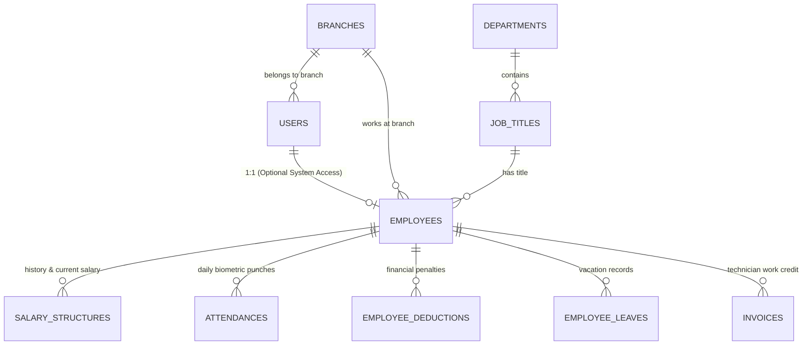
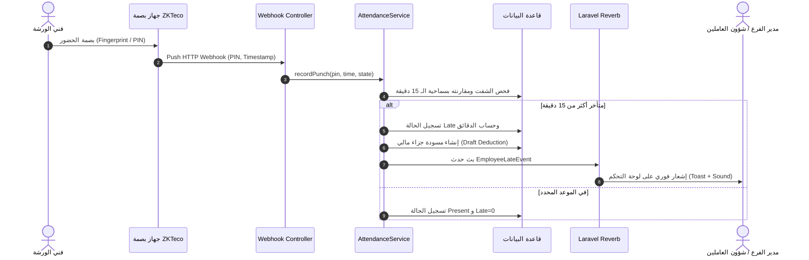

# دليل الهندسة الإدارية وشؤون الموظفين والفنيين (Administration, RBAC & Workforce Architecture)

> **طبيعة الوثيقة:** مواصفة تقنية ومعمارية كاملة (Technical Specification) لنظام إدارة الصلاحيات متعدد الفروع وشؤون العاملين وفنيي مركز الحسيني لبطاريات السيارات وإدارة الورشة.

---

## 1. فلسفة الربط بين الإدارة والموظفين (User vs. Employee Architecture)

من الأخطاء المعمارية الشائعة في الأنظمة دمج جدول المستخدمين `users` مع جدول الموظفين `employees` في جدول واحد. في مركز الحسيني:
- **الموظف (`Employee`):** كيان حقيقي في شؤون العاملين (له رقم قومي، تاريخ تعيين، شفت عمل، بصمة ZKTeco، هيكل راتب، جزاءات، وإجازات). **ليس كل موظف يمتلك حساباً للدخول على النظام** (مثل عمال الورشة والفنيين الميدانيين).
- **المستخدم (`User`):** حساب دخول على لوحة التحكم (له بريد إلكتروني، كلمة مرور، أدوار وصلاحيات).
- **العلاقة:** علاقة `One-to-One Nullable`؛ حيث يحتوي جدول `employees` على حقل `user_id` اختياري. إذا تم ترقية الفني ليصبح كاشيراً أو مدير فرع، يتم إنشاء حساب `User` وربطه بسجله الوظيفي.



---

## 2. مصفوفة الأدوار والصلاحيات (Role-Based Access Control - RBAC)

يتم الاعتماد على حزمة **`spatie/laravel-permission`** مع تطبيق الأدوار الخمسة الصارمة للمركز:

| الدور (Role) | الوصف ونطاق العمليات | الصلاحيات الأساسية الممنوحة |
|---|---|---|
| **المدير العام (Super Admin)** | الإدارة العليا للمركز بكافة فروعه | صلاحيات مطلقة: إنشاء الفروع، اعتماد مسيرات الرواتب النهائية، تعديل الحدود الائتمانية لكبار العملاء، التقارير المالية والربحية، ضبط لائحة الجزاءات. |
| **مدير الفرع (Branch Manager)** | إدارة فرع محدد من فروع المركز | متابعة حضور وانصراف موظفي الفرع، اعتماد أذونات التأخير والإجازات، الاطلاع على تقارير مبيعات الفرع، تسوية الكاش اليومي، تحويل بطاريات الكهنة لمصانع التدوير. |
| **مشرف الورشة (Workshop Supervisor)** | الإشراف الفني على ورشة البطاريات | فحص بطاريات الضمان (اختبار الجهد وتيار التدوير CCA)، الموافقة على استبدال البطاريات المعيبة، توزيع مهام الصيانة والتركيب على الفنيين. |
| **الكاشير (Cashier)** | مسؤول نقطة البيع والتحصيل | فتح الشيفت، مسح الباركود، إصدار الفواتير، استلام المبالغ النقدية وتأكيد سداد الآجل، إدخال بيانات بطاريات الكهنة، طباعة الإيصالات (80mm). يمنع عليه حذف الفواتير أو تعديل أسعار التكلفة. |
| **فني البطاريات (Technician)** | فني صيانة وتركيب البطاريات | ليس لديه دخول إداري، ولكن يتم تسجيل كوده في الفواتير وكروت الضمان لاحتساب كفاءة التركيب وعمولات الإنجاز الفني. |

---

## 3. مخطط قاعدة بيانات شؤون العاملين (HR Data Schema)

### جدول الإجازات الرسمية والعارضة (`employee_leaves`)
```php
Schema::create('employee_leaves', function (Blueprint $table) {
    $table->id();
    $table->foreignId('employee_id')->constrained()->cascadeOnDelete();
    $table->enum('leave_type', ['annual', 'sick', 'emergency', 'unpaid'])->default('annual');
    $table->date('start_date');
    $table->date('end_date');
    $table->unsignedSmallInteger('days_count');
    $table->text('reason');
    $table->enum('status', ['pending', 'approved', 'rejected'])->default('pending')->index();
    $table->foreignId('actioned_by')->nullable()->constrained('users')->nullOnDelete();
    $table->text('action_notes')->nullable();
    $table->timestamps();

    $table->index(['employee_id', 'start_date', 'status']);
});
```

### جدول عمولات الفنيين على المبيعات والتركيب (`technician_commissions`)
تحفيز الفنيين عبر عمولة ثابتة أو نسبة على كل بطارية يتم تركيبها أو فحصها:
```php
Schema::create('technician_commissions', function (Blueprint $table) {
    $table->id();
    $table->foreignId('employee_id')->constrained()->cascadeOnDelete();
    $table->foreignId('invoice_id')->constrained()->cascadeOnDelete();
    $table->decimal('commission_amount', 10, 2);
    $table->enum('status', ['pending', 'approved', 'paid'])->default('pending')->index();
    $table->foreignId('payroll_id')->nullable()->constrained()->nullOnDelete(); // يتم ربطها بمسير الراتب عند الصرف
    $table->timestamps();

    $table->unique(['employee_id', 'invoice_id']);
});
```

---

## 4. دورات العمل الإدارية التلقائية (Automated Administrative Workflows)

### أ. دورة الحضور والتأخير الذكية (Smart Attendance Flow)


### ب. دورة احتساب واعتماد مسيرات الرواتب (Payroll Settlement Flow)
1. **توليد المسودة (Draft Generation):** في نهاية كل شهر ميلادي، يقوم مدير الفرع بالضغط على "توليد مسير الرواتب".
2. **المعالجة الآلية (Batch Processing):**
   - الراتب الأساسي + البدلات الثابتة (من `salary_structures`).
   - $\sum$ عمولات التركيب المعتمدة للشهر (من `technician_commissions`).
   - $\sum$ ساعات العمل الإضافي المعتمدة ($Overtime \times HourlyRate \times 1.5$).
   - طرح $\sum$ أيام الغياب غير المبررة ($AbsentDays \times DayRate$).
   - طرح $\sum$ الجزاءات المالية المعتمدة (من `employee_deductions`).
3. **المراجعة والاعتماد (Review & Approval):**
   - يراجع مدير الفرع الأرقام ويؤكد صحتها (`status = reviewed`).
   - يقوم المدير العام (Super Admin) بالاعتماد النهائي (`status = approved`).
4. **الصرف والإغلاق (Disbursement):**
   - يتم الصرف وتوليد كشوفات المرتبات المطبوعة وتغيير الحالة إلى `disbursed`.
   - إقفال السجلات لمنع أي تعديل رجعي على الحضور أو الجزاءات الخاصة بذلك الشهر.

---

## 5. ميزات لوحة تحكم الإدارة وشؤون العاملين (Management UI Features)

1. **مؤشرات الأداء اللحظية (Live KPI Counters):**
   - إجمالي العاملين في الفرع والورشة.
   - عدد المتواجدين على رأس العمل حالياً.
   - الفنيين في إجازات رسمية.
   - عدد المتأخرين اليوم مع إمكانية تبرير التأخير بضغطة زر واحدة للمدير.
2. **كارت الملف التعريفي الشامل للموظف (Employee 360 Profile):**
   - الصورة، الرقم الوظيفي، الرقم القومي، الفرع، الشفت، وتاريخ التعيين.
   - جدول حركة الحضور والغياب لآخر 30 يوماً.
   - رصيد الإجازات المتبقي (سنوي، مرضي، عارضة).
   - سجل الجزاءات والمكافآت وتفاصيل كل جزاء.
   - إحصائية بعدد البطاريات التي قام بتركيبها أو فحصها بالورشة خلال الشهر.
3. **الأمان وسجل التدقيق (Audit Trail):**
   - توثيق من قام بإضافة أو تعديل أي راتب أو جزاء أو إجازة (`actioned_by`, `approved_by`).
