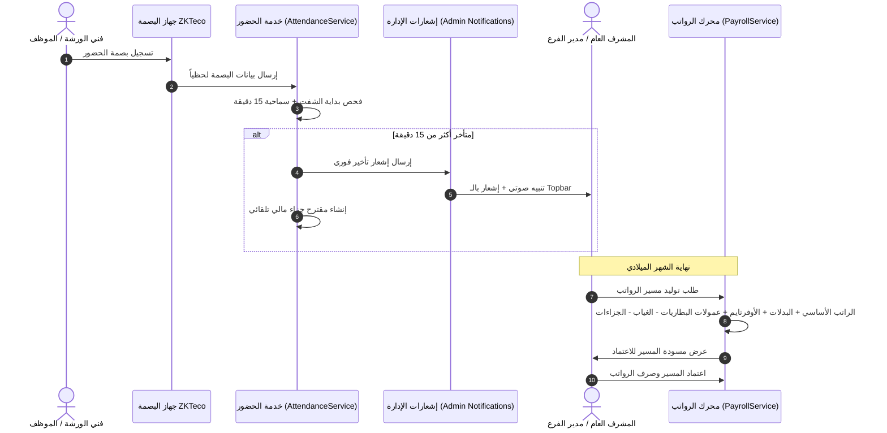

# نظام شؤون العاملين والورشة والحضور والانصراف والرواتب والإشعارات
### (HR, Attendance, Payroll, Deductions & Admin Notifications System)

> **طبيعة المجلد:** مجلد فني مخصص ومستقل يركز بنسبة 100% على التنفيذ الفعلي والتطبيقي لكافة مكونات شؤون الموظفين وفنيي الورشة والرواتب والجزاءات والإشعارات الفورية للإدارة في مركز الحسيني.

---

## 📑 فهرس مراحل تنفيذ نظام شؤون الموظفين (HR Phases)

| المرحلة | اسم الملف | المحتوى التقني بالتفصيل |
|---|---|---|
| **المرحلة 1** | [HR_PHASE_01_FORM_REQUESTS.md](file:///d:/Projects/Al-Husseini/plans/hr_system/HR_PHASE_01_FORM_REQUESTS.md) | طلبات التحقق والمدخلات (`StoreEmployeeRequest`, `RecordPunchRequest`, `StoreLeaveRequest`, `StoreDeductionRequest`, `GeneratePayrollRequest`). |
| **المرحلة 2** | [HR_PHASE_02_SERVICES_LOGIC.md](file:///d:/Projects/Al-Husseini/plans/hr_system/HR_PHASE_02_SERVICES_LOGIC.md) | المحركات الرياضية (`AttendanceService`, `PayrollService`, `DeductionService`) مع المعادلات المحاسبية الصارمة. |
| **المرحلة 3** | [HR_PHASE_03_NOTIFICATIONS.md](file:///d:/Projects/Al-Husseini/plans/hr_system/HR_PHASE_03_NOTIFICATIONS.md) | إشعارات الإدارة في قاعدة البيانات والـ Realtime (`EmployeeLateNotification`, `LeaveRequestNotification`, `PayrollReadyNotification`). |
| **المرحلة 4** | [HR_PHASE_04_CONTROLLERS_ROUTES.md](file:///d:/Projects/Al-Husseini/plans/hr_system/HR_PHASE_04_CONTROLLERS_ROUTES.md) | وحدات التحكم والمسارات مع الصلاحيات وحماية العمليات (`EmployeeController`, `AttendanceController`, `PayrollController`). |
| **المرحلة 5** | [HR_PHASE_05_UI_BLADE_BINDING.md](file:///d:/Projects/Al-Husseini/plans/hr_system/HR_PHASE_05_UI_BLADE_BINDING.md) | ربط قوالب Blade وإلغاء `hr-store.js` و `localStorage` وربط جرس التنبيهات في الـ Topbar. |

---

## 🛠️ تدفق العمليات الإدارية (Business Workflow)

