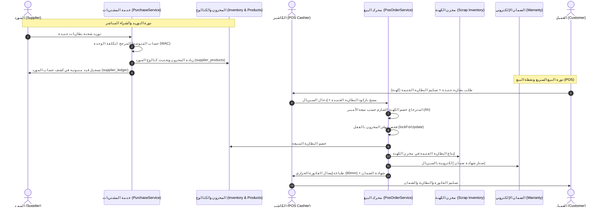

# 🚗 Al-Husseini Management System
# 📦 الخطة الهندسية لقطاع المبيعات ونقاط البيع والتوريدات والموردين
### (Sales, POS, Multi-Supplier Purchasing, Scrap, Warranties & Accounting Master Plan)

> **طبيعة المجلد:** مجلد فني تنفيذي مستقل وشامل يحدد خطوات بناء وهندسة قطاع المبيعات ونقاط البيع السريعة، والتوريدات متعددة الموردين، وإدارة بطاريات الكهنة، والضمانات، وحسابات الآجل، وعمولات الفنيين في مركز الحسيني (فرع دمياط الجديدة).

---

## 📑 فهرس مراحل التنفيذ الفنية (Implementation Phases)

| المرحلة | اسم الملف الفني | المحتوى والهدف التقني | الحالة |
| :--- | :--- | :--- | :--- |
| **المرحلة 1** | [PHASE_01_DATABASE_SCHEMA_MIGRATIONS.md](PHASE_01_DATABASE_SCHEMA_MIGRATIONS.md) | جداول قواعد البيانات، الكتالوج المشترك `supplier_products`، جدول تسعير الكهنة الصارم `scrap_pricing_tiers`، الدفع المجزأ `invoice_payments`، وتذاكر الضمان `warranty_claims`، مع الـ Seeders. | ✅ مكتملة ومختبرة |
| **المرحلة 2** | [PHASE_02_MODELS_RELATIONS_OBSERVERS.md](PHASE_02_MODELS_RELATIONS_OBSERVERS.md) | نماذج Eloquent، الخصائص المصبوبة (Casts)، العلاقات المتقدمة، والمراقبين (`PurchaseInvoiceObserver`, `InvoiceObserver`, `WarrantyClaimObserver`). | ✅ مكتملة ومختبرة |
| **المرحلة 3** | [PHASE_03_FORM_REQUESTS_VALIDATION.md](PHASE_03_FORM_REQUESTS_VALIDATION.md) | طلبات التحقق المخصصة، فحص توفر المخزون، منع تكرار السريال، والتحقق من موافقة تجاوز حد الائتمان (Manager Override). | ✅ مكتملة ومختبرة |
| **المرحلة 4** | [PHASE_04_SERVICES_BUSINESS_LOGIC.md](PHASE_04_SERVICES_BUSINESS_LOGIC.md) | طبقة الخدمات والعقود المعيارية: `SupplierService`, `PurchaseService`, `PosOrderService`, `WarrantyService`, `ScrapBatteryService` مع محرك المتوسط المرجح WAC. | ✅ مكتملة ومختبرة |
| **المرحلة 5** | [PHASE_05_CONTROLLERS_ROUTES_PERMISSIONS.md](PHASE_05_CONTROLLERS_ROUTES_PERMISSIONS.md) | وحدات التحكم الرفيعة (Thin Controllers)، مسارات الـ Admin، خريطة صلاحيات Spatie، وحماية العمليات الحساسة. | ✅ مكتملة ومختبرة |
| **المرحلة 6** | [PHASE_06_UI_BLADE_COMPONENTS_PRINTING.md](PHASE_06_UI_BLADE_COMPONENTS_PRINTING.md) | واجهة الكاشير السريعة، إدخال السريال بالباركود، الطباعة الحرارية المزدوجة (80mm + A4)، وشاشة مخزن الكهنة وتجارة الرصاص المستقلة. | ✅ مكتملة ومختبرة |
| **المرحلة 7** | [PHASE_07_TESTING_VERIFICATION.md](PHASE_07_TESTING_VERIFICATION.md) | حزمة اختبارات Pest شاملة تغطي كافة السيناريوهات والحالات الحدية (7 قطاعات تشغيلية) وضمان عدم كسر أي من الاختبارات السابقة. | ✅ مكتملة ومختبرة (119/119 اختبار ناجح) |

---

## 🔄 المخطط العام لتدفق العمليات (Overall Process Architecture)

---

## 🛡️ المبادئ والقرارات التشغيلية الصارمة (System Core Invariants)

1. **الكتالوج متعدد الموردين:** علاقة `Many-to-Many` عبر `supplier_products` مع تسجيل آخر سعر شراء والمورد المفضل.
2. **المتوسط المرجح (WAC):** إعادة احتساب تكلفة وحدة المنتج فورياً مع كل شحنة توريد جديدة.
3. **تسعير الكهنة الصارم:** منع التعديل اليدوي للكاشير نهائياً، والالتزام بجدول تسعير سعة الأمبير `scrap_pricing_tiers`.
4. **السريال والضمان:** تسجيل السريال لحظة البيع فقط على الكاشير، مع دعم الطباعة الحرارية (80mm) والشهادة المستقلة (A4/A5).
5. **شاشة الكهنة وتجارة الرصاص:** شاشة وقسم مستقل في الشريط الجانبي (`admin/scrap-inventory`) لمتابعة إجمالي الأطنان والسعات وزر بيع الشحنة.
6. **الدفع المجزأ وتجاوز الائتمان:** دعم الدفع المركب (كاش + فيزا + آجل)، وتجاوز الائتمان مشروط بموافقة المدير (`Manager Override`).
7. **عمولات الفنيين:** مبالغ قطعية محددة لكل نوع خدمة ترحل تلقائياً لمسيرات رواتب الـ HR.
8. **الأمان المالي:** جميع العمليات المالية والمخزنية داخل `DB::transaction` وقفل الصفوف بـ `lockForUpdate()`.
9. **منظومة الفهرسة والبحث اللحظي:** فهارس بحث مركبة على الجداول الجديدة، وتوسيع خدمة `SearchService` (Spotlight Ctrl+K) للبحث بأكواد الموردين (`supplier_sku`) وتذاكر الضمان (`claim_number`) وفواتير الشراء، مع محرك Autocomplete لحظي للكاشير يدعم قارئ الباركود ومطابقة النصوص العربية (`normalizeArabic`).

